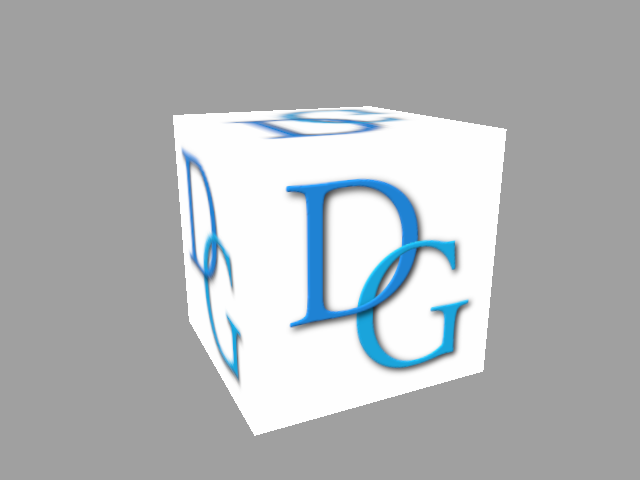

# DiligentSamples

This module contains tutorials and sample applications intended to demonstrate the usage of [Diligent Engine](https://github.com/DiligentGraphics/DiligentEngine). The module depends on the [Core](https://github.com/DiligentGraphics/DiligentCore) and [Tools](https://github.com/DiligentGraphics/DiligentTools) submodules.

To build and run the applications in the module, please follow the [instructions](https://github.com/DiligentGraphics/DiligentEngine/blob/master/README.md) in the master repository.

# Tutorials

## [Tutorial 01 - Hello Triangle](Tutorials/Tutorial01_HelloTriangle)

This tutorial shows how to render a simple triangle using Diligent Engine API.

## [Tutorial 02 - Cube](Tutorials/Tutorial02_Cube)

This tutorial demonstrates how to render an actual 3D object, a cube. It shows how to load shaders from files, create and use vertex, 
index and uniform buffers.

## [Tutorial 03 - Texturing](Tutorials/Tutorial03_Texturing)

This tutorial demonstrates how to apply a texture to a 3D object. It shows how to load a texture from file, create shader resource
binding object and how to sample a texture in the shader.

## [Tutorial 04 - Instancing](Tutorials/Tutorial04_Instancing)

This tutorial demonstrates how to use instancing to render multiple copies of one object
using unique transformation matrix for every copy.

## [Tutorial 05 - Texture Array](Tutorials/Tutorial05_TextureArray)

This tutorial demonstrates how to combine instancing with texture arrays to 
use unique texture for every instance.

## [Tutorial 06 - Multithreading](Tutorials/Tutorial06_Multithreading)

This tutorial shows how to generate command lists in parallel from multiple threads.

## [Tutorial 07 - Geometry Shader](Tutorials/Tutorial07_GeometryShader)

This tutorial shows how to use geometry shader to render smooth wireframe.

## [Tutorial 08 - Tessellation](Tutorials/Tutorial08_Tessellation)

This tutorial shows how to use hardware tessellation to implement simple adaptive terrain 
rendering algorithm.

## [Tutorial 09 - Quads](Tutorials/Tutorial09_Quads)

This tutorial shows how to render multiple 2D quads, frequently swithcing textures and blend modes.

# Samples

## AntTweakBar Sample

This sample demonstrates how to use [AntTweakBar library](http://anttweakbar.sourceforge.net/doc) to create simple user interface. 

## Atmospheric Light Scattering sample

The sample implements physically-based atmospheric light scattering model and demonstrates how Diligent Engine can be used to accomplish various rendering tasks: loading textures from files, using complex shaders, rendering to textures, using compute shaders and unordered access views, etc.

# Build and Run Instructions

Please refer to Build and Run Instructions section of the [master repository's readme](https://github.com/DiligentGraphics/DiligentEngine/blob/master/README.md).

# Version History

## v2.2

* Enabled MacOS and iOS platforms
* Fixed multiple issues with OpenGL/GLES

## v2.1.b

* Removed legacy VS projects and solutions
* Added tutorials:
  * 01 - Hello Triangle
  * 02 - Cube
  * 03 - Texturing
  * 04 - Instancing
  * 05 - Texture Array
  * 06 - Multithreading
  * 07 - Geometry Shader
  * 08 - Tessellation

## v2.1.a

* Refactored build system to use CMake and Gradle for Android
* Added support for Linux platform

## v2.1

## v2.0.alpha

## v1.0.0

Initial release

# License

Licensed under the [Apache License, Version 2.0](License.txt)

**Copyright 2015-2018 Egor Yusov**
