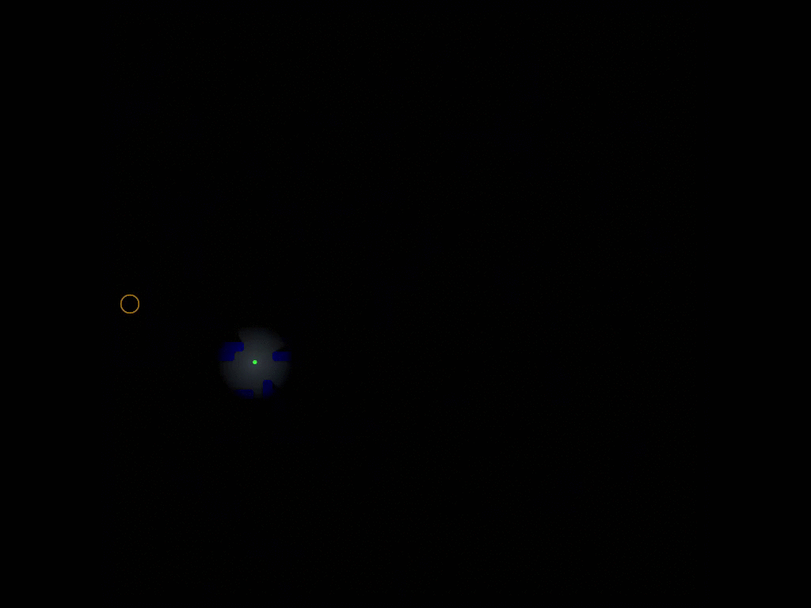
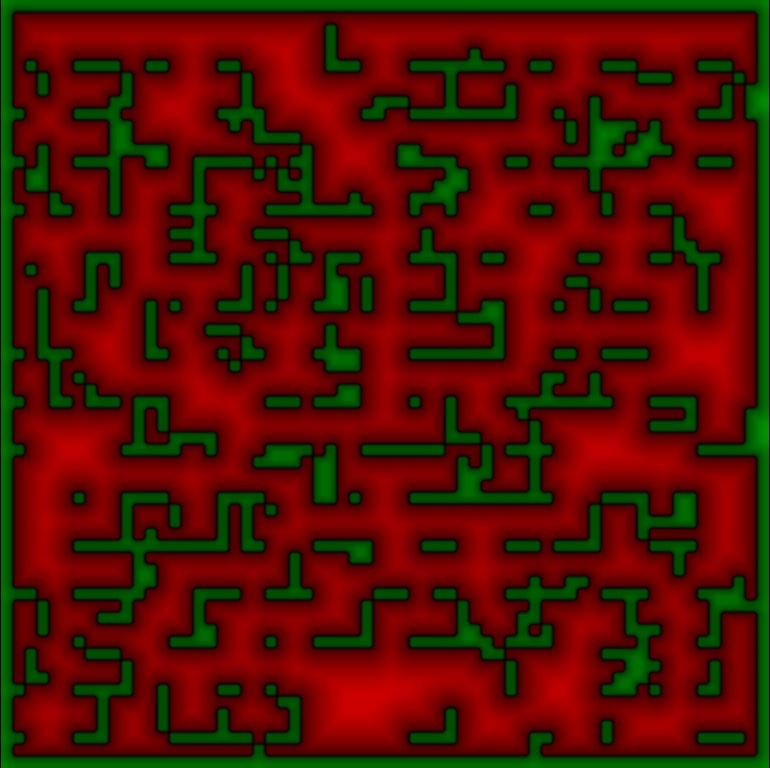

# GLFW Demo



This simple maze mini-game demonstrates how to use [GLFW](https://www.glfw.org/) to create window and handle keyboard and mouse input.

## GLFW Initialization

GLFW natively supports OpenGL and Vulkan only.
To use all available backends, we need to use `GLFW_NO_API` flag to create GLFW window only:

```cpp
glfwInit();
glfwWindowHint(GLFW_CLIENT_API, GLFW_NO_API);

m_Window = glfwCreateWindow(Width, Height, Title, nullptr, nullptr);
```

Initialization of the render device and device context is performed similar to other examples (take a look at Tutorial00 for instance).

To create a swapchain, we need to prepare the `NativeWindow` structure. To
get native handles, we will use the appropriate platform-specific GLFW functions:

```cpp
#if PLATFORM_WIN32
    Win32NativeWindow Window{glfwGetWin32Window(m_Window)};
#endif
#if PLATFORM_LINUX
    LinuxNativeWindow Window;
    Window.WindowId = glfwGetX11Window(m_Window);
    Window.pDisplay = glfwGetX11Display();
#endif
#if PLATFORM_MACOS
    MacOSNativeWindow Window{GetNSWindowView(m_Window)};
#endif
```

On MacOS, we need to additionally initialize `CAMetalLayer` to allow rendering into the view using the Metal API:

```cpp
void* GetNSWindowView(GLFWwindow* wnd)
{
    id Window = glfwGetCocoaWindow(wnd);
    id View   = [Window contentView];
    
    NSBundle* bundle = [NSBundle bundleWithPath:@"/System/Library/Frameworks/QuartzCore.framework"];
    if (!bundle)
        return nullptr;
    
    id Layer = [[bundle classNamed:@"CAMetalLayer"] layer];
    if (!Layer)
        return nullptr;
    
    [View setLayer:Layer];
    [View setWantsLayer:YES];
    
    return View;
}
```

## The Maze Game

The goal of this mini-game is to reach the target point in the maze using the flashlight to find the way in the dark.

Controls:
* `WASD`, arrows, or numpad arrows: move the player.<br/>
* `Tab`: generate new map.<br/>
* `Esc`: exit the game.<br/>
* Left mouse button: activate the flashlight.<br/>

There are no pre-drawn textures and meshes in this game, only procedural content.
The maze is randomly generated, the target point is placed in the empty space near one of the map borders
(note that there is no 100% guarantees that the target point can be reached).
For rendering, the game uses signed-distance fields (SDF) and ray marching.

The map is a 16-bit floating-point single-channel texture that contains:
* When outside the wall, the distance from the nearest wall; this distance has positive sign (red color).
* When insdie the wall, the distance to the nearest empty space; this distance has negative sign (green color).



The player shape and light around the player are circles with the attenuation from the center to border.
The circle function is the distance from the current pixel to the player position:

```cpp
float  DistToPlayer = distance(PosOnMap, g_PlayerConstants.PlayerPos);
float Factor = saturate(1.0 - DistToPlayer / g_PlayerConstants.PlayerRadius);
Color.rgb    = Blend(Color.rgb, PlayerColor, Factor);
```

The target point (or the teleport to the next map) is rendered as a circle with wave animation:

```cpp
const float DistToTeleport = distance(PosOnMap, g_MapConstants.TeleportPos);
const float WaveWidth = 0.2;
float       Wave      = BumpStep(DistToTeleport, g_MapConstants.TeleportWaveRadius, g_MapConstants.TeleportWaveRadius + WaveWidth);
Color.rgb             = Blend(Color.rgb, TeleportWaveColor, Wave);
```

`BumpStep()` in the snippet above converts the distance in the range [0, inf] to the range [WaveRadius, WaveRadius + WaveWidth],
then converts it to the triangle wave `/\/\` in the range [0, 1]. The result is a circle outline.

`TeleportWaveRadius` is animated using the `WaveRadius = fract(WaveRadius + TimeDelta)` function, and produces another triangle wave 
`/|/|`. It creates the repeating effect of a pulsing circle with increasing radius from 0 to 1.

Flashlight uses a bit more complex function.
First, we calculate the distance from the current pixel to the flashlight ray. 
Calculate `A`, `B`, `C` coefficients of the line equation `Ax + By + C = 0` and get minimal distance from the point to the ray:

```cpp
float2 Dir       = g_PlayerConstants.FlashLightDir;
float2 Begin     = g_PlayerConstants.PlayerPos;
float2 End       = Begin + Dir;
float  A         = Begin.y - End.y;
float  B         = End.x - Begin.x;
float  C         = Begin.x * End.y - End.x * Begin.y;
float  DistToRay = abs((A * PosOnMap.x + B * PosOnMap.y + C) / sqrt(A * A + B * B));
```

This code can be simplified to:

```cpp
float  DistToRay = abs((-Dir.y * PosOnMap.x) + (Dir.x * PosOnMap.y) + (Begin.x * End.y - End.x * Begin.y));
```

The radius of the light cone is calculated as `ConeHeight * tan(Angle)/2`:

```cpp
float  TanOfAngle = 0.5; // tan(45 degrees) * 0.5
float  ConeRadius = DistToPlayer * TanOfAngle;
```

The light attenuation is proportional to the distance squared:

```cpp
float  Atten  = DistToPlayer / g_PlayerConstants.FlshLightMaxDist;
Atten         = saturate(1.0 - Atten * Atten);
float  Factor = saturate(1.0 - DistToRay / ConeRadius) * g_PlayerConstants.FlashLightPower * Atten;
LightColor    = Blend(LightColor, FlashLightColor, Factor);
```

To cast shadows, we use the sphere tracing algorithm on the signed distance field.
We trace a ray from the current pixel position to the light source position. The function returns 1 if there
are no intersections, which means the pixle is in light.
All coordinates and distances in the snippet below are in SDF texture space:

```cpp
float TraceRay(float2 LightPos, float2 Origin)
{
    const float  TMax    = distance(LightPos, Origin);   // distance from current pixel to light source.
    const float  MinDist = 0.00625;                      // some minimal value.
    const int    MaxIter = 128;                          // maximum number of loop cycles to prevent infinite loops.
    const float2 Dir     = normalize(LightPos - Origin); // ray marching direction.
    float2       Pos     = Origin;                       // ray marching start position.
    float        t       = 0.0;                          // ray length

    for (int i = 0; i < MaxIter; ++i)
    {
        // read the maximum radius of the sphere inside which there are no intersections
        float d = ReadSDF(Pos);

        // stop ray marching on negative or too small distance
        if (d < MinDist)
            break;

        // me can increase ray length to the sphere radius
        t += d;

        // calculate new position
        Pos = Origin + Dir * t;

        // stop ray marching if ray distance is equal or greater than distance from current pixel to the light source
        if (t > TMax)
            break;
    }
    return t > TMax ? 1.0 : 0.0;
}
```

To implement soft shadows, we cast additional rays:

```cpp
float Shading = TraceRay(g_PlayerConstants.PlayerPos, PosOnMap) * 0.5;

float2 Norm = float2(-DirToPlayer.y, DirToPlayer.x); // left normal to the line
Shading += TraceRay(g_PlayerConstants.PlayerPos, PosOnMap + Norm * 0.125) * 0.25;
Shading += TraceRay(g_PlayerConstants.PlayerPos, PosOnMap - Norm * 0.125) * 0.25;
```
