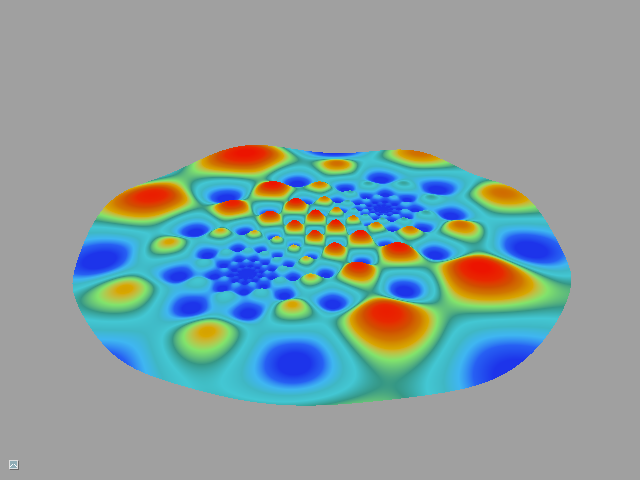

# Tutorial10 - Ring Buffer

This tutorial shows how to use persistent mapped buffer and fences to implement ring buffer.



## Shaders

## Initializing the Pipeline State


## Creating Vertex and Index Buffers

To create a vertex buffer, we first prepare the data to fill the buffer with. Our
vertex layout corresponds to the following structure:

```cpp
struct Vertex
{
    float3 pos;
    float4 color;
};
```

Our vertex buffer will contain 8 vertices. Every vertex will have position and color:

```cpp
//      (-1,+1,+1)________________(+1,+1,+1) 
//               /|              /|
//              / |             / |
//             /  |            /  |
//            /   |           /   |
//(-1,-1,+1) /____|__________/(+1,-1,+1)
//           |    |__________|____| 
//           |   /(-1,+1,-1) |    /(+1,+1,-1)
//           |  /            |   /
//           | /             |  /
//           |/              | /
//           /_______________|/ 
//        (-1,-1,-1)       (+1,-1,-1)
// 

Vertex CubeVerts[8] =
{
    {float3(-1,-1,-1), float4(1,0,0,1)},
    {float3(-1,+1,-1), float4(0,1,0,1)},
    {float3(+1,+1,-1), float4(0,0,1,1)},
    {float3(+1,-1,-1), float4(1,1,1,1)},

    {float3(-1,-1,+1), float4(1,1,0,1)},
    {float3(-1,+1,+1), float4(0,1,1,1)},
    {float3(+1,+1,+1), float4(1,0,1,1)},
    {float3(+1,-1,+1), float4(0.2f,0.2f,0.2f,1)},
};
```

Similar to unifrom buffer, to create a vertex buffer, we populate `BufferDesc` structure. Since
data in the buffer will never change, we create the buffer with static usage (`USAGE_STATIC`)
and provide initial data to `CreateBuffer()`:

```cpp
BufferDesc VertBuffDesc;
VertBuffDesc.Name = "Cube vertex buffer";
VertBuffDesc.Usage = USAGE_STATIC;
VertBuffDesc.BindFlags = BIND_VERTEX_BUFFER;
VertBuffDesc.uiSizeInBytes = sizeof(CubeVerts);
BufferData VBData;
VBData.pData = CubeVerts;
VBData.DataSize = sizeof(CubeVerts);
pDevice->CreateBuffer(VertBuffDesc, VBData, &m_CubeVertexBuffer);
```

Index buffer is initialized in a very similar fashion.


## Rendering

There are few changes that we need to make to our rendering procedure compared to Tutorial01.
First, we need to update our transformation matrix. Since we created our constant buffer
as dynamic buffer, it can be mapped. Diligent Engine provides `MapHelper` template class
that facilitates buffer mapping:

```cpp
{
    // Map the buffer and write current world-view-projection matrix
    MapHelper<float4x4> CBConstants(m_pImmediateContext, m_VSConstants, MAP_WRITE, MAP_FLAG_DISCARD);
    *CBConstants = transposeMatrix(m_WorldViewProjMatrix);
}
```

Second, we need to bind vertex and index buffer to the GPU pipeline:

```cpp
Uint32 offset = 0;
IBuffer *pBuffs[] = {m_CubeVertexBuffer};
m_pImmediateContext->SetVertexBuffers(0, 1, pBuffs, &offset, SET_VERTEX_BUFFERS_FLAG_RESET);
m_pImmediateContext->SetIndexBuffer(m_CubeIndexBuffer, 0);
```

Finally, this time the draw call is an indexed one:

```cpp
DrawAttribs DrawAttrs;
DrawAttrs.IsIndexed = true; // This is an indexed draw call
DrawAttrs.IndexType = VT_UINT32; // Index type
DrawAttrs.NumIndices = 36;
m_pImmediateContext->Draw(DrawAttrs);
```
