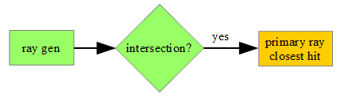
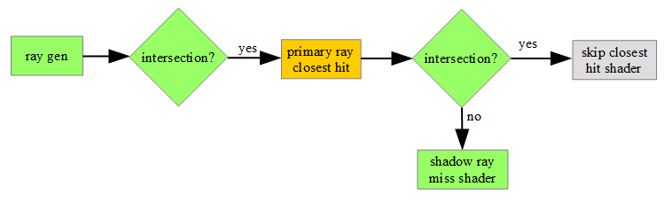
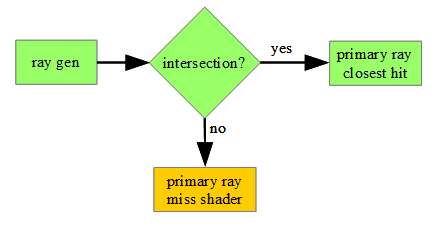
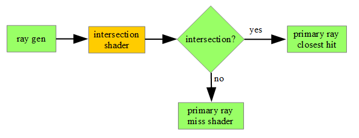
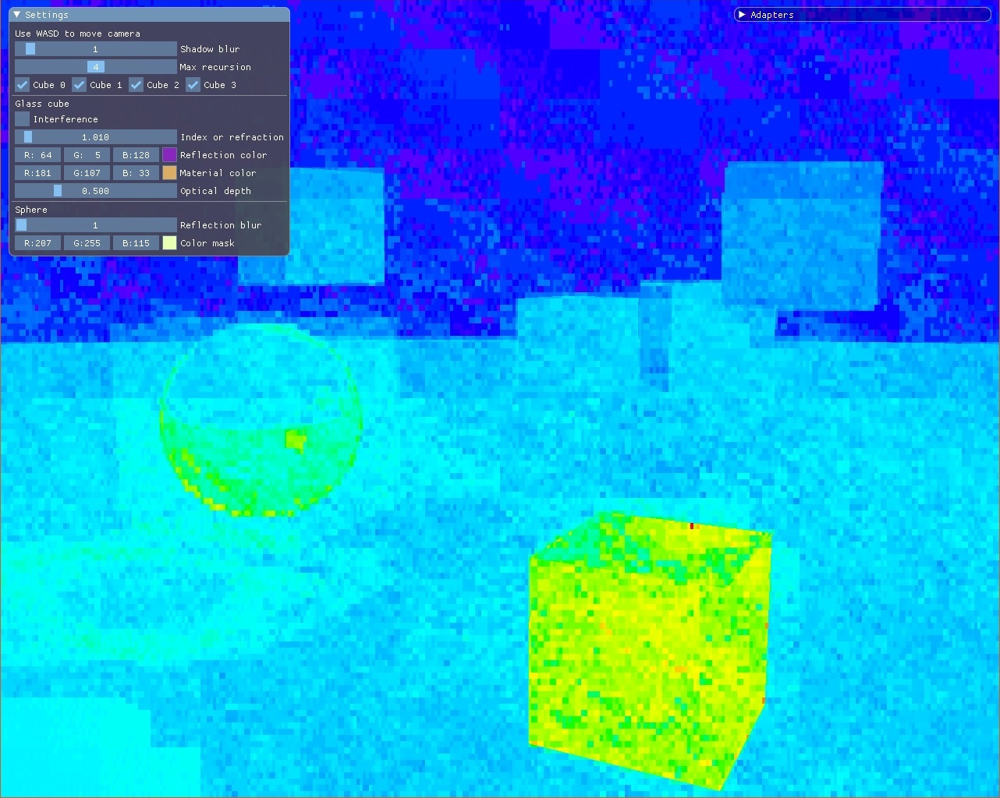
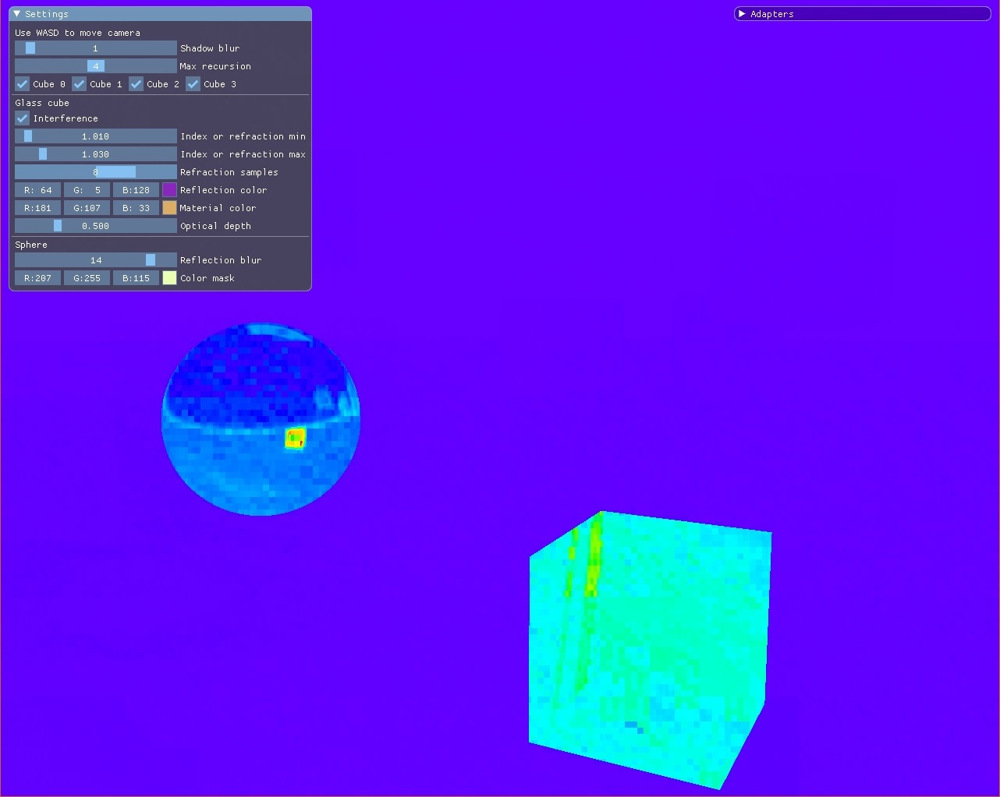

# Tutorial21 - Ray Tracing

This tutorial demonstrates the basics of using ray tracing API in Diligent Engine.


In a traditional rendering pipeline triangles are processed by a number of programmable and
fixed-function stages and are eventually projected and rasterized over the regular pixel grid.
The final color is formed by a pixel shader and a number of optional blending operations.
This is a very efficient and high-performance method, but performance comes for the price
of a number of limitations. First, the pixel shader can only be invoked for the predefined
sample locations (which enables GPUs to parallelize the execution very efficiently). Second,
the GPU does not have access to the whole scene and only triangles visible by the camera
are processed.

Ray tracing removes these limitations. Unlike the rasterization, it allows application to
query scene properties at any location by casting a ray in any direction and running a specified
shader at the intersection point. Ray tracing unlocks a variety of algorithms that have no
efficient implementation in rasterization-based pipeline.

This tutorial demonstrates how ray tracing API in Diligent Engine can be used to simulate
physics-based light transport in a scene to render soft shadows, multiple-bounce reflections
and refractions, and dispersion.

Ray tracing is supported in D3D12 and Vulkan backends. Diligent Engine exposes common API for both
backends and require no special handling for any of them. Shaders authored in HLSL will work in both
backends without any special tricks or hacks. Vulkan backend can also take ray tracing shaders written
in GLSL as well as compiled SPIRV bytecode.

## Acceleration Structures

Unlike rasterization, where objects do not require any pre-processing and can be thrown into
the pipeline rightaway, things are a bit more complicated in ray tracing. Since a ray can be
cast in any direction, the GPU must have an efficient way of intersecting the ray with the entire
scene. This way is provided by acceleration structures that internally encomass some sort of bounding
volume hierarchies.

There are two types of acceleration structures (AS) in ray tracing API: bottom-level AS, and
top-level AS. Bottom-level acceleration structure (BLAS) is where the actual geometry resides.
Top-level acceleration structure is a set of references to one or more BLASes. One TLAS may reference
multiple instances of the same BLAS with different transformations. BLASes are more expensive to build 
or update than TLASes. The two-level structure is a trade-off between the ability to update the AS 
at run-time and ray tracing efficiency. For example, object animation can be implemented by updating 
instance transformations in the TLAS without the need to rebuild BLASes that represent animated objects.

### Creating Bottom-level Acceleration Structures

There are two types of geometries that a BLAS can contain: triangle geometry or procedural.
Triangle geometry is represented by a conventional set of vertices and indices.
Procedural geometry requires an application to define a special type of shader that determines
how a ray intersects the object. That shader can implement any custom algorithm, but is more 
expensive than a built-in ray-triangle intersection test.

A single BLAS may contain only one type of geometry: either triangles or axis-aligned bounding boxes (AABBs) that
define the basic object shape.

In this tutorial we will be using two types of objects: a cube and a sphere. The cube will be defined by
a triangle geometry, while the sphere will be defined as procedural geometry.
The cube data will be the same as in previous tutorials, but we will access it through a uniform buffer,
so that a closest hit shader can read triangle properties (position, normal, UVs) for any primitive.

For our cube BLAS, we specify a single triangle geometry with 24 vertices and 12 primitives. 
BLAS will allocate space that is enough for this geometry description:

```cpp
const float3 CubePos[24] = /* ... */;
const uint   Indices[36] = /* ... */;

BLASTriangleDesc Triangles;
Triangles.GeometryName         = "Cube";
Triangles.MaxVertexCount       = _countof(CubePos);
Triangles.VertexValueType      = VT_FLOAT32;
Triangles.VertexComponentCount = 3;
Triangles.MaxPrimitiveCount    = _countof(Indices) / 3;
Triangles.IndexType            = VT_UINT32;

BottomLevelASDesc ASDesc;
ASDesc.Name          = "Cube BLAS";
ASDesc.Flags         = RAYTRACING_BUILD_AS_PREFER_FAST_TRACE;
ASDesc.pTriangles    = &Triangles;
ASDesc.TriangleCount = 1;

m_pDevice->CreateBLAS(ASDesc, &m_pCubeBLAS);
```

Note that in this tutorial `GeometryName` member is not used anywhere else except in BLAS build, but in other cases,
the geometry name may be used to change geometry data using BLAS update operation.
Geometry name may also be used in a shader binding table as described below (see [Shader binding table](#creating-shader-binding-table)).

The cube BLAS is now created, but contains no data: we need to initialize it. For that,
we will need to create regular vertex and index buffers, with the only difference that
we will use the `BIND_RAY_TRACING` flag to allow access to the buffers during the BLAS build operation.
All buffers which are used in BLAS or TLAS build commands must be created with `BIND_RAY_TRACING` flag.
The GPU will need some scratch space to perform the build operation and keep temporary data. The scratch
buffer must be given to `BuildBLAS` command.
Call `m_pCubeBLAS->GetScratchBufferSizes()` to get the minimal buffer size.

```cpp
BLASBuildTriangleData TriangleData;
TriangleData.GeometryName         = Triangles.GeometryName;
TriangleData.pVertexBuffer        = pCubeVertexBuffer;
TriangleData.VertexStride         = sizeof(CubePos[0]);
TriangleData.VertexCount          = Triangles.MaxVertexCount;
TriangleData.VertexValueType      = Triangles.VertexValueType;
TriangleData.VertexComponentCount = Triangles.VertexComponentCount;
TriangleData.pIndexBuffer         = CubeIndexBuffer;
TriangleData.PrimitiveCount       = Triangles.MaxPrimitiveCount;
TriangleData.IndexType            = Triangles.IndexType;
TriangleData.Flags                = RAYTRACING_GEOMETRY_FLAG_OPAQUE;

BuildBLASAttribs Attribs;
Attribs.pBLAS             = m_pCubeBLAS;
Attribs.pTriangleData     = &TriangleData;
Attribs.TriangleDataCount = 1;
Attribs.pScratchBuffer    = pScratchBuffer;

m_pImmediateContext->BuildBLAS(Attribs);
```

Note that `GeometryName` member of `BLASBuildTriangleData` struct instance must match
the geomertry name used in `BLASTriangleDesc`. When BLAS contains multiple geometries, this
is how triangle data is mapped to the specific geometry in the BLAS.

Creating BLAS for procedural sphere is performed in a similar fashion.


### Creating Top-level Acceleration Structure

Top-level acceleration structure represents the entire scene and consists of multiple BLAS instances. 
To create a TLAS, we only need to specify the number of instances it will contain:

```cpp
TopLevelASDesc TLASDesc;
TLASDesc.Name             = "TLAS";
TLASDesc.MaxInstanceCount = NumInstances;
TLASDesc.Flags            = RAYTRACING_BUILD_AS_ALLOW_UPDATE | RAYTRACING_BUILD_AS_PREFER_FAST_TRACE;
m_pDevice->CreateTLAS(TLASDesc, &m_pTLAS);
```

Additional flags tell the system how the structure will be used by the application:
`RAYTRACING_BUILD_AS_ALLOW_UPDATE` flag allows the TLAS to be updated after it has been created with different instance transformations;
`RAYTRACING_BUILD_AS_PREFER_FAST_TRACE` flag tells the GPU to make some optimization to improve ray tracing efficiency,
for the price of extra build time.

Similar to BLAS, a new TLAS contains no data and needs to be built. To build a TLAS, we need to prepare an array
of `TLASBuildInstanceData` structs, where every element will contain the instance data:

```cpp
Instances[0].InstanceName = "Cube Instance 1";
Instances[0].CustomId     = 0; // texture index
Instances[0].pBLAS        = m_pCubeBLAS;
Instances[0].Mask         = OPAQUE_GEOM_MASK;

Instances[1].InstanceName = "Cube Instance 2";
Instances[1].CustomId     = 1; // texture index
Instances[1].pBLAS        = m_pCubeBLAS;
Instances[1].Mask         = OPAQUE_GEOM_MASK;
AnimateOpaqueCube(Instances[1]);

...

Instances[5].InstanceName = "Sphere Instance";
Instances[5].CustomId     = 0; // box index
Instances[5].pBLAS        = m_pProceduralBLAS;
Instances[5].Mask         = OPAQUE_GEOM_MASK;

Instances[6].InstanceName = "Glass Instance";
Instances[6].pBLAS        = m_pCubeBLAS;
Instances[6].Mask         = TRANSPARENT_GEOM_MASK;
```

The `InstanceName` member is used in TLAS update operation to match the instance data to the previous instance state and
is also used in the shader binding table to bind the shader hit groups to instances (see [Shader binding table](#creating-shader-binding-table)).

Hit shader can query the instance index in the array via `InstanceIndex()` function. `CustomId` 
member is specified by the user and is passed to the hit shader via `InstanceID()` function.
`CustomId` may be used to apply different materials to each instance with the same geometry.

`Mask` can be used to group instances and trace rays only against selected groups (e.g. shadow rays vs primary rays).

For each instance, we specify the transformation matrix with the rotation and translation:

```cpp
Instances[6].Transform.SetTranslation(3.0f, 4.0f, -5.0f);
```

Updating the instance transformation during the TLAS update operation is much faster than 
updating BLAS with vertex transformation or using the transform buffer.

To build/update TLAS, we need to prepare an instance of `BuildTLASAttribs` struct:

```cpp
BuildTLASAttribs Attribs;
Attribs.HitGroupStride = HIT_GROUP_STRIDE;
Attribs.BindingMode    = HIT_GROUP_BINDING_MODE_PER_INSTANCE;
```

`HitGroupStride` is the number of different ray types. In this tutorial we use two ray types: primary and shadow.
You may add more ray types, e.g. a secondary ray that uses simplified hit shaders for reflected rays.

`BindingMode` is the hit group location calculation mode. In our example we will be assigning different 
hit groups to different instances, so we use the `HIT_GROUP_BINDING_MODE_PER_INSTANCE` mode. If an application 
needs more control, it can use `HIT_GROUP_BINDING_MODE_PER_GEOMETRY` mode to assign indiviudal hit group to 
each geometry within every instance. On the other hand, it can use `HIT_GROUP_BINDING_MODE_PER_TLAS` mode 
to assign the same hit group to all geometries in all instances.

The actual TLAS instance data is stored in an instance buffer. The required size per one instance is fixed and
is given by `TLAS_INSTANCE_DATA_SIZE` constant (64 bytes).

Similar to BLAS build operation, the GPU requires a scratch buffer to keep temporary data.
The required scratch buffer sizes for building and updating is given by `m_pTLAS->GetScratchBufferSizes()` method.

```cpp
Attribs.pInstances      = Instances;
Attribs.InstanceCount   = _countof(Instances);
Attribs.pInstanceBuffer = m_InstanceBuffer;
Attribs.pScratchBuffer  = m_ScratchBuffer;
Attribs.pTLAS           = m_pTLAS;
m_pImmediateContext->BuildTLAS(Attribs);
```


## Initializing the Pipeline State

Ray tracing pipeline state object is more complex than a graphics or a compute pipeline as
there may be multiple shaders of the same type in one shader stage. This is required so that
the GPU can run different shaders when hitting different objects.

Similar to other pipeline types, we start by creating all shaders that will be used by
the ray tracing pipeline.
Diligent Engine allows using HLSL for both D3D12 and Vulkan backends. The minimum HLSL shader model that
supports ray tracing is 6.3.
Only the new DirectX compiler (DXC) supports shader model 6.0+, and we need to explicitly specify it:

```cpp
ShaderCI.ShaderCompiler = SHADER_COMPILER_DXC;
ShaderCI.HLSLVersion    = {6, 3};
ShaderCI.SourceLanguage = SHADER_SOURCE_LANGUAGE_HLSL;
```

To create a ray tracing PSO, we need to define an instance of `RayTracingPipelineStateCreateInfo` struct:

```cpp
RayTracingPipelineStateCreateInfo PSOCreateInfo;
PSOCreateInfo.PSODesc.PipelineType = PIPELINE_TYPE_RAY_TRACING;
```

The main component of a ray tracing pipeline is a set of shader hit groups.
There are three group types:

- *General hit group* that contains a single ray generation, ray miss or callable shader.
- *Triangle hit group* that contains a closest hit shader and an optional any-hit shader.
- *Procedural hit group* that contains an intersection shader and optional closest hit and any-hit shaders.

Our ray-tracing pipeline will contain the following hit groups:

```cpp
const RayTracingGeneralShaderGroup GeneralShaders[] =
{
    {"Main",        pRG},
    {"PrimaryMiss", pPrimaryMiss},
    {"ShadowMiss",  pShadowMiss}
};
const RayTracingTriangleHitShaderGroup TriangleHitShaders[] =
{
    {"CubePrimaryHit",  pCubePrimaryHit},
    {"GroundHit",       pGroundHit},
    {"GlassPrimaryHit", pGlassPrimaryHit}
};
const RayTracingProceduralHitShaderGroup ProceduralHitShaders[] =
{
    {"SpherePrimaryHit", pSphereIntersection, pSpherePrimaryHit},
    {"SphereShadowHit",  pSphereIntersection}
};

PSOCreateInfo.pGeneralShaders          = GeneralShaders;
PSOCreateInfo.GeneralShaderCount       = _countof(GeneralShaders);
PSOCreateInfo.pTriangleHitShaders      = TriangleHitShaders;
PSOCreateInfo.TriangleHitShaderCount   = _countof(TriangleHitShaders);
PSOCreateInfo.pProceduralHitShaders    = ProceduralHitShaders;
PSOCreateInfo.ProceduralHitShaderCount = _countof(ProceduralHitShaders);
```

Besides the hit groups, we must define a few additional fields:

```cpp
PSOCreateInfo.RayTracingPipeline.MaxRecursionDepth = MaxRecursionDepth;
PSOCreateInfo.RayTracingPipeline.ShaderRecordSize  = 0;

PSOCreateInfo.MaxAttributeSize = max(sizeof(/*BuiltInTriangleIntersectionAttributes*/float2), sizeof(ProceduralGeomIntersectionAttribs));
PSOCreateInfo.MaxPayloadSize   = max(sizeof(PrimaryRayPayload), sizeof(ShadowRayPayload));
```

`MaxRecursionDepth` specifies the number of recursive calls that an application may make in ray tracing shaders.
Zero means that only ray generation shader may be executed. 1 means that ray generation shader may
spawn rays that will not be allowed to generate another rays. 2 means that closest hit shaders of the rays spawned
by the ray generation shader will also be allowed to generated secondary rays, etc.

`MaxRecursionDepth` field is used by the driver to allocate the required stack size. An application should manually
control the recursion depth and must not exceed the specified limit to avoid driver crashes.
The maximum allowed value for this field is 31.

`ShaderRecordSize` can be used to specify constants for each shader or instance or geometry, the maximum supported 
size is 4096 bytes minus the shader handle size (32 bytes).

`MaxAttributeSize` and `MaxPayloadSize` are only used in DirectX 12 backend. These values should be as small as possible
to minimize the memory usage.

When everything is ready, we call `CreateRayTracingPipelineState` to create the PSO:

```
m_pDevice->CreateRayTracingPipelineState(PSOCreateInfo, &m_pRayTracingPSO);
```


## Creating Shader Binding Table

Another key component of the ray tracing setup is the Shader Binding Table (SBT) that is used to 
connect the instances in the TLAS with the shaders in ray tracing PSO that will be executed
when a ray hits a particular instance.
SBT must be created with the same pipeline that will be used with the trace rays command.

To create an SBT we define an instance of `ShaderBindingTableDesc` struct and call `CreateSBT()`
device method:

```cpp
ShaderBindingTableDesc SBTDesc;
SBTDesc.Name = "SBT";
SBTDesc.pPSO = m_pRayTracingPSO;
m_pDevice->CreateSBT(SBTDesc, &m_pSBT);
```

After the SBT is created, we start making shader associations. 
The first shader we need to bind is the ray generation shader,
which is the entry point for the ray tracing pipeline, and is
very similar to a compute shader.
```cpp
m_pSBT->BindRayGenShader("Main");
```

Notice that `"Main"` is the name of the general shader group that contains
the ray generation shader that we used in our ray tracing PSO.


Next, we bind miss shaders. A miss shader is executed if a ray doesn't hit any object.
We use different behavior for primary and shadow rays and thus have two miss shaders:

```cpp
m_pSBT->BindMissShader("PrimaryMiss", PRIMARY_RAY_INDEX);
m_pSBT->BindMissShader("ShadowMiss",  SHADOW_RAY_INDEX );
```

Again, `"PrimaryMiss"` and `"ShadowMiss"` are the names that we associated with the
miss shaders when created the PSO. The second parameter to `BindMissShader` function
is the miss shader index: 0 for primary rays, and 1 for shadow rays.

Next, we define a set of hit shaders for different TLAS instances:

```cpp
m_pSBT->BindHitGroupForInstance(m_pTLAS, "Cube Instance 1",  PRIMARY_RAY_INDEX, "CubePrimaryHit"  );
m_pSBT->BindHitGroupForInstance(m_pTLAS, "Cube Instance 2",  PRIMARY_RAY_INDEX, "CubePrimaryHit"  );
m_pSBT->BindHitGroupForInstance(m_pTLAS, "Cube Instance 3",  PRIMARY_RAY_INDEX, "CubePrimaryHit"  );
m_pSBT->BindHitGroupForInstance(m_pTLAS, "Cube Instance 4",  PRIMARY_RAY_INDEX, "CubePrimaryHit"  );
m_pSBT->BindHitGroupForInstance(m_pTLAS, "Ground Instance",  PRIMARY_RAY_INDEX, "GroundHit"       );
m_pSBT->BindHitGroupForInstance(m_pTLAS, "Glass Instance",   PRIMARY_RAY_INDEX, "GlassPrimaryHit" );
m_pSBT->BindHitGroupForInstance(m_pTLAS, "Sphere Instance",  PRIMARY_RAY_INDEX, "SpherePrimaryHit");
```

The first argument of `BindHitGroupForInstance()` method is the TLAS object that contains the instance.</br>
The second argument is the instance name for which the hit group will be bound. These names must match the
names we gave to the instances when created the TLAS.</br>
The third argument is the ray offset in the shader binding table. The hit groups above are defined for the primary ray.</br>
The last argument is the hit group name that was defined in `TriangleHitShaders` array during the pipeline initialization.


For shadow rays we disable all hit shader invocation by using empty shader name or `nullptr`.
We use `BindHitGroupForTLAS` method to bind empty shader for all instances for shadow ray type at once:

```cpp
m_pSBT->BindHitGroupForTLAS(m_pTLAS, SHADOW_RAY_INDEX, nullptr);
```

Procedural sphere, though, requires some special care: we need to provide the intersection shader so that
the GPU knows how to intersect the rays with our procedural object. Closest hit shader is not needed, so
we will use the `"SphereShadowHit"` hit group that only contains the intersection shader:

```cpp
m_pSBT->BindHitGroupForInstance(m_pTLAS, "Sphere Instance",  SHADOW_RAY_INDEX,  "SphereShadowHit");
```

After all hit groups are bound, we need to update the internal SBT buffer:

```cpp
m_pImmediateContext->UpdateSBT(m_pSBT);
```

Note that a TLAS can be created with `BindingMode = HIT_GROUP_BINDING_MODE_PER_GEOMETRY` flag, 
in which case hit groups can be individually specified for each geometry in every instance, for example:

```cpp
m_pSBT->BindHitGroupForGeometry(m_pTLAS, "Cube Instance 1", "Cube", PRIMARY_RAY_INDEX, "CubePrimaryHit"  );
```

The resulting SBT will contain the following data:

| Location | Instance        | Geometry | Ray type | Shader group     | Shader constants |
|----------|-----------------|----------|----------|------------------|------------------|
|        0 | Cube Instance 1 | Cube     | primary  | CubePrimaryHit   | -                |
|        1 |                 |          | shadow   | empty            | -                |
|        2 | Cube Instance 2 | Cube     | primary  | CubePrimaryHit   | -                |
|        3 |                 |          | shadow   | empty            | -                |
|        4 | Cube Instance 3 | Cube     | primary  | CubePrimaryHit   | -                |
|        5 |                 |          | shadow   | empty            | -                |
|        6 | Cube Instance 4 | Cube     | primary  | CubePrimaryHit   | -                |
|        7 |                 |          | shadow   | empty            | -                |
|        8 | Ground Instance | Cube     | primary  | GroundHit        | -                |
|        9 |                 |          | shadow   | empty            | -                |
|       10 | Glass Instance  | Cube     | primary  | GlassPrimaryHit  | -                |
|       11 |                 |          | shadow   | empty            | -                |
|       12 | Sphere Instance | Box      | primary  | SpherePrimaryHit | -                |
|       13 |                 |          | shadow   | SphereShadowHit  | -                |

'Shader group' and 'Shader constants' is what is actually stored in the SBT, other fields in the table are used to calculate
the data location.

As an alternative, you can use `IShaderBindingTable::BindHitGroupByIndex()` to bind hit group directly to any location
in the range from `TLASBuildInfo::FirstContributionToHitGroupIndex` to `TLASBuildInfo::LastContributionToHitGroupIndex`,
call `ITopLevelAS::GetBuildInfo()` to get the build info.


## Resource Binding

Unlike others pipelines, in the ray tracing pipeline we use multiple shaders with the same type.
Resources with the same name in shaders with the same type are considered the same resource.
They must be defined identically, e.g.:

```hlsl
// in closest_hit_shader1:
ConstantBuffer<CubeAttribs>  g_CubeAttribsCB : register(b0); // OK - shader register is ignored and will be remapped

// in closest_hit_shader2:
ConstantBuffer<CubeAttribs>  g_CubeAttribsCB : register(b1); // OK - shader register is ignored and will be remapped
```

Note that shader registers assigned by the compiler or shader developer are ignored and will
be remapped by the engine.

It is an error to have different resource types with the same name in different shaders in
the *same shader stage*, e.g.:

```hlsl
// in closest_hit_shader1:
ConstantBuffer<CubeAttribs>    g_CubeAttribs;

// in closest_hit_shader2:
StructuredBuffer<CubeAttribs>  g_CubeAttribs; // ERROR - g_CubeAttribs is already defined as constant buffer 
                                              //         in another closest hit shader
```

To fix the error above, rename one of the shader variables to have a distinct name.

It is OK to have different resource types with the same name in *different shader stages*:


```hlsl
// in closest_hit_shader:
ConstantBuffer<CubeAttribs>    g_CubeAttribs;

// in any_hit_shader:
StructuredBuffer<CubeAttribs>  g_CubeAttribs; // OK - namespaces for different shader types
                                              //      do not overlap
```

Other than the specifics above, creating an SRB and binding shader resources is done similar
to other pipeline types:

```cpp
m_pRayTracingPSO->CreateShaderResourceBinding(&m_pRayTracingSRB, true);

m_pRayTracingSRB->GetVariableByName(SHADER_TYPE_RAY_GEN, "g_ConstantsCB")->Set(m_ConstantsCB);
m_pRayTracingSRB->GetVariableByName(SHADER_TYPE_RAY_CLOSEST_HIT, "g_ConstantsCB")->Set(m_ConstantsCB);
```


## Tracing the Rays

Before starting the ray tracing, we animate instances by updating their transformations in the TLAS.
Updating acceleration structures is much faster and takes less memory than building them from scratch.

```cpp
UpdateTLAS();
```

Ray tracing is started by `TraceRays` device context method.
The method takes the ray grid dimensions and the SBT as parameters:

```cpp
TraceRaysAttribs Attribs;
Attribs.DimensionX        = m_pColorRT->GetDesc().Width;
Attribs.DimensionY        = m_pColorRT->GetDesc().Height;
Attribs.pSBT              = m_pSBT;
Attribs.SBTTransitionMode = RESOURCE_STATE_TRANSITION_MODE_TRANSITION;
m_pImmediateContext->TraceRays(Attribs);
```

In this tutorial we generate one ray per screen pixel, so `DimensionX` and `DimensionY` are the
render target dimensions.

Then the result of ray tracing is copied to the swapchain image using a simple graphics pipeline.
In a more complex renderer this pass will be replaced by tone mapping or other post processing effects.

### Ray Generation Shader

Ray generation shader is the entry point of the ray tracing pipeline. Its purpose is to
generate the primary rays.
In the ray generation shader, we calculate the normalized texture coordinates `uv` and use them to calculate 
the ray direction from the inverse view-projection matrix:

```hlsl
struct Constants
{
    float4   CameraPos;
    float4x4 InvViewProj;
    ...
};
ConstantBuffer<Constants> g_ConstantsCB;

...
float2 uv       = (float2(DispatchRaysIndex().xy) + float2(0.5, 0.5)) / float2(DispatchRaysDimensions().xy);
float4 worldPos = mul(float4(uv * 2.0 - 1.0, 1.0, 1.0), g_ConstantsCB.InvViewProj);
float3 rayDir   = normalize(worldPos.xyz/worldPos.w - g_ConstantsCB.CameraPos.xyz);
```

Next, we prepare the RayDesc struct and call `CastPrimaryRay` helper function:

```hlsl
RayDesc ray;
ray.Origin    = g_ConstantsCB.CameraPos.xyz;
ray.Direction = rayDir;
ray.TMin      = g_ConstantsCB.ClipPlanes.x;
ray.TMax      = g_ConstantsCB.ClipPlanes.y;

PrimaryRayPayload payload = CastPrimaryRay(ray, /*recursion number*/0);
```

`CastPrimaryRay()` ray function calculates the final color of a pixel on the screen and generates secondary rays for reflection and refraction.
It wraps the `TraceRay()` HLSL intrinsic function for reusability. `CastPrimaryRay()` is defined as follows:

```hlsl
RaytracingAccelerationStructure g_TLAS;

PrimaryRayPayload CastPrimaryRay(RayDesc ray, uint Recursion)
{
    PrimaryRayPayload payload = {float3(0, 0, 0), 0.0, Recursion};

    if (Recursion >= g_ConstantsCB.MaxRecursion)
    {
        // set pink color for debugging
        payload.Color = float3(0.95, 0.18, 0.95);
        return payload;
    }
    TraceRay(g_TLAS,            // Acceleration structure
             RAY_FLAG_NONE,
             ~0,                // Instance inclusion mask - all instances are visible
             PRIMARY_RAY_INDEX, // Ray contribution to hit group index (aka ray type)
             HIT_GROUP_STRIDE,  // Multiplier for geometry contribution to hit 
                                // group index (aka the number of ray types)
             PRIMARY_RAY_INDEX, // Miss shader index
             ray,
             payload);
    return payload;
}
```

Note that we check the ray recursion depth and terminate it if current depth exceeds the maximum depth.
It is essential to do this because GPU device does not automatically stop ray tracing when the maximum recursion 
depth is reached and will crash if we exceed the limit specified during the PSO initialization.

At the end of the ray generation shader, we write the payload color to the output UAV texture:

```hlsl
g_ColorBuffer[DispatchRaysIndex().xy] = float4(payload.Color, 1.0);
```


### Closest Hit Shader

The closest hit shader is executed when a ray hits a triangle geometry or when a custom intersection shader reports the hit
(see [Intersection Shader](#intersection-shader)).

The following image shows the workflow for the primary ray closest hit shader:



The closest hit shader takes geometry intersection information and editable ray payload as inputs:

```hlsl
[shader("closesthit")]
void main(inout PrimaryRayPayload payload, in BuiltInTriangleIntersectionAttributes attr)
```

To compute the attributes of the hit point, we will use the 3-component barycentric coordinates:

```hlsl
float3 barycentrics = float3(1.0 - attr.barycentrics.x - attr.barycentrics.y, attr.barycentrics.x, attr.barycentrics.y);
```

The built-in `PrimitiveIndex()` function gives us the index of the current primitive. Using this index, we can read
the 3 vertex indices from the cube constant data buffer:

```hlsl
uint3  primitive = g_CubeAttribsCB.Primitives[PrimitiveIndex()].xyz;
```

We then use the barycentric coordinates to calculate the texture coordinates at the intersection point:

```hlsl
float2 uv = g_CubeAttribsCB.UVs[primitive.x].xy * barycentrics.x +
            g_CubeAttribsCB.UVs[primitive.y].xy * barycentrics.y +
            g_CubeAttribsCB.UVs[primitive.z].xy * barycentrics.z;
```

Similarly, we get the triangle normal. Note though that we need to apply the object-to-world transformation
that is given by `ObjectToWorld3x4()` intrinsic function:

```hlsl
float3 normal = g_CubeAttribsCB.Normals[primitive.x].xyz * barycentrics.x +
                g_CubeAttribsCB.Normals[primitive.y].xyz * barycentrics.y +
                g_CubeAttribsCB.Normals[primitive.z].xyz * barycentrics.z;
normal        = normalize(mul((float3x3) ObjectToWorld3x4(), normal));
```

In ray tracing, `Texture2D::Sample()` method is not supported because the GPU can not implicitly calculate derivatives,
so we have to calculate the texture mipmap level manually or provide explicit gradients for anisotropic filtering. In this tutorial 
we don't do that and just sample the finest mip level for simplicity:

```hlsl
payload.Color = g_Texture[InstanceID()].SampleLevel(g_SamLinearWrap, uv, 0).rgb;
```

The last step is lighting calculation.
We use built-in functions to get the ray parameters and calculate the intersection point.

```hlsl
float3 pos = WorldRayOrigin() + WorldRayDirection() * RayTCurrent();
LightingPass(payload.Color, pos, normal, payload.Recursion + 1);
```

We then cast a ray to test if the light is occluded or not and apply a simple diffuse lighting:

```hlsl
void LightingPass(inout float3 Color, float3 Pos, float3 Norm, uint Recursion)
{
    float3  col = float3(0.0, 0.0, 0.0);
    for (int i = 0; i < NUM_LIGHTS; ++i)
    {
        float  NdotL = max(0.0, dot(Norm, rayDir));
        
        // Optimization - don't trace rays if NdotL is zero
        if (NdotL > 0.0)
        {
            RayDesc ray;

            // Add a small offset to avoid self-intersections.
            ray.Origin    = Pos + Norm * 0.001;
            ray.Direction = normalize(g_ConstantsCB.LightPos[i].xyz - Pos);

            // Limit max ray length by distance to light source.
            ray.TMax      = distance(g_ConstantsCB.LightPos[i].xyz, Pos);
            ray.TMin      = 0.0;

            col += CastShadow(ray, Recursion).Shading * NdotL * Color * g_ConstantsCB.LightColor[i].rgb;
        }
    }
    Color = col / float(NUM_LIGHTS) + g_ConstantsCB.AmbientColor.rgb;
}
```

For shadow rays we use a new payload type, `ShadowRayPayload` that only contains two components to minimize the memory usage.

To improve ray tracing performance we use the following flags:

- `RAY_FLAG_ACCEPT_FIRST_HIT_AND_END_SEARCH` - stop ray processing immediately if any geometry hit is encountered.
- `RAY_FLAG_FORCE_OPAQUE` - skip any-hit shader invocation.

In SBT, we bind null hit group for shadow ray for triangle geometry. For procedural geometry we use the intersection shader only,
so we don't have any closest hit shaders anyway, and `RAY_FLAG_SKIP_CLOSEST_HIT_SHADER` flag may have no effect in our particular case.
However, if we used the same hit groups for shadow rays as for the primary rays, we might have seen a significant performance improvement.

Note that for some shading techniques this optimization may be inapplicable. For example: for ambient 
occlusion you may need to know the precise distance to the nearest occluder instead of the binary information about 
the presence or absence of the intersection, so you will have to use the closest hit shader to write the distance 
from `RayTCurrent()`.

We use an instance mask `OPAQUE_GEOM_MASK` to skip transparent cube with refractions.
Light calculation for objects with refractions is much more complex and is ignored for shadows.

The initial `Shading` value is set to 0 meaning that the object is completely shadowed.
It will be preserved if any intersection is found, but will be overwritten by 1 in the miss shader, indicating no occlusion.

The `CastShadow()` function is defined as follows:

```hlsl
ShadowRayPayload CastShadow(RayDesc ray, uint Recursion)
{
    ShadowRayPayload payload = {0.0, Recursion};
    if (Recursion >= g_ConstantsCB.MaxRecursion)
    {
        payload.Shading = 1.0;
        return payload;
    }
    TraceRay(g_TLAS,            // Acceleration structure
             RAY_FLAG_FORCE_OPAQUE | RAY_FLAG_SKIP_CLOSEST_HIT_SHADER | RAY_FLAG_ACCEPT_FIRST_HIT_AND_END_SEARCH,
             OPAQUE_GEOM_MASK,  // Instance inclusion mask - only opaque instances are visible
             SHADOW_RAY_INDEX,  // Ray contribution to hit group index (aka ray type)
             HIT_GROUP_STRIDE,  // Multiplier for geometry contribution to hit
                                // group index (aka the number of ray types)
             SHADOW_RAY_INDEX,  // Miss shader index
             ray,
             payload);
    return payload;
}
```

The following diagram shows the workflow for shadow rays:



Note that some hardware does not support ray recursion, but you can use a loop in the ray generation shader instead.


### Miss Shader

Miss shader is executed if no intersections were found.



As an input, the miss shader takes only editable ray payload:

```hlsl
[shader("miss")]
void main(inout PrimaryRayPayload payload)
```

Miss shader for primary ray generates the sky color.</br>
Miss shader for shadow ray just writes 1.0 into the payload to indicate no occlusion.


### Intersection Shader

An intersection shader can be used with procedural geometry only. For a triangle geometry, built-in hardware accelerated intersection test is used.
Intersection shader is executed for each ray that intersects with the AABB. Note that depending on the implementation, the intersection shader may 
be executed even if the AABB is occluded by another geometry, so the intersection test should be as fast as possible. You also need to be very
careful if an intersection shader has any side effects such as writing data to an UAV.



Intersection shader does not have any inputs or outputs.

```cpp
[shader("intersection")]
void main()
```

We don't have any information about the intersection, so we need to use the same AABB which was specified when building
the BLAS and calculate the intersection point in the shader.
If there is an intersection, we report the hit to the system using the `ReportHit()` intrinsic function:

```cpp
ProceduralGeomIntersectionAttribs attr;
...
ReportHit(hitT, RAY_KIND_PROCEDURAL_FRONT_FACE, attr);
```


## Performance

With default settings, the execution time of the shaders for all rays is approximately the same.




When we increase the number of rays per pixel, the performance for some pixels increases dramatically.
You should minimize multiple rays per pixel and use temporal techniques like a TAA or denoising.




## Further Reading

[DirectX spec](https://microsoft.github.io/DirectX-Specs/d3d/Raytracing.html)</br>
[GLSL spec](https://github.com/KhronosGroup/GLSL/blob/master/extensions/ext/GLSL_EXT_ray_tracing.txt)</br>
[Tips and Tricks: Ray Tracing Best Practices](https://developer.nvidia.com/blog/rtx-best-practices/)</br>
[Best Practices: Using NVIDIA RTX Ray Tracing](https://developer.nvidia.com/blog/best-practices-using-nvidia-rtx-ray-tracing/)</br>
