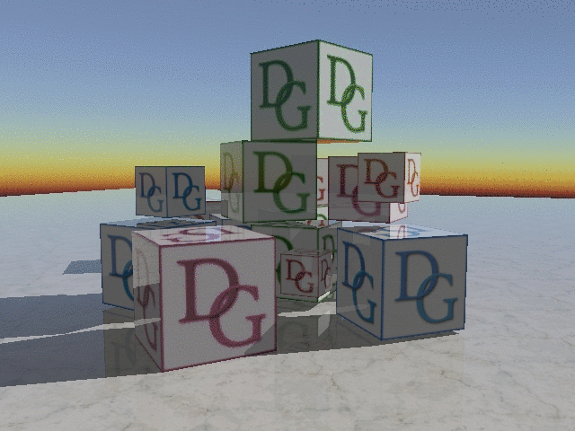

# Tutorial 22 - Hybrid Rendering

This tutorial demonstrates how to implement a simple hybrid renderer that combines rasterization with ray tracing.



Ray tacing is very useful for creating high-quality effects that are difficult to do with rasterization (e.g. reflections),
but its performance is generally much lower. This tutorial demonstrates a simple hybrid rendering approach,
where the scene is first rendered into the G-buffer with rasterization, and then ray-tracing is used to compute
reflections and shadows. The rendering process consists of three stages:

- G-buffer pass: a simple G-buffer that contains color, normals, and depth is rendered. 
- Ray tracing from compute shader: reflections and shadows are computed. 
- Post processing: results of the first two stages are combined into a shaded scene.

This tutorial runs in Vulkan, DirectX12 and Metal (on compatible hardware).

## Scene Description

Ray tracing shaders need to have access to the entire scene, since, unlike rasterization, it is unknown ahead of time which 
object a ray will hit. To achieve this, we use bindless mode, where all required textures, buffers, samplers and other
resources are bound once and can be dynamically indexed by any draw call. In this tutorial, we use a single vertex and index
buffer that store multiple meshes, but a real application may use buffer arrays for multiple index and vertex buffers.

Each scene objects is described by the following structure:

```cpp
struct ObjectAttribs
{
    float4x4 ModelMat;
    float4x3 NormalMat;

    uint MaterialId;
    uint FirstIndex;
    uint FirstVertex;
    uint MeshId; 
};
```

`ModelMat` and `NormalMat` are local-to-world transformations for object positions and normals. `MaterialId` indicates the object material.
`FirstIndex` and `FirstVertex` specify the position of the first index and first vertex in the index and vertex buffers correspondingly.
`MeshId` is currently unused, but may indicate e.g. an index in the vertex buffer array.

For ray tracing, each mesh needs a bottom-level acceleration structure (BLAS). Note that in some cases, it may better to merge all static meshes 
into a single BLAS, which may improve ray tracing performance and speed up top-level AS construction.

```cpp
struct Mesh
{
    RefCntAutoPtr<IBottomLevelAS> BLAS;
    RefCntAutoPtr<IBuffer>        VertexBuffer;
    RefCntAutoPtr<IBuffer>        IndexBuffer;
    ...
};
```

BLAS and TLAS construction is performed
[similar to previous tutorial](https://github.com/DiligentGraphics/DiligentSamples/tree/master/Tutorials/Tutorial21_RayTracing#acceleration-structures).

To decrease the number of draw calls, objects with the same mesh are drawn using instancing.

```cpp
struct InstancedObjects
{
    Uint32 MeshInd             = 0;
    Uint32 ObjectAttribsOffset = 0;
    Uint32 NumObjects          = 0;
};
```

Note that when we access a resource by index in the shader, we need to use `NonUniformResourceIndex()` qualifier, since
otherwise the compiler may assume that this index is constant during the draw call and may apply optimizations
that will result in an undefined behaviour:

```cpp
void main(in  PSInput  PSIn,
          out PSOutput PSOut)
{
    MaterialAttribs Mtr = g_MaterialAttribs[NonUniformResourceIndex(PSIn.MatId)];

    PSOut.Color =
        Mtr.BaseColorMask * g_Textures[NonUniformResourceIndex(Mtr.BaseColorTexInd)].
                            Sample(g_Samplers[NonUniformResourceIndex(Mtr.SampInd)], PSIn.UV);
    PSOut.Norm  = float4(normalize(PSIn.Norm), 0.0);
}
```

## Metal ray tracing

All shaders are written in HLSL and can be used by DirectX12 and Vulkan backends directly. For compatibility with Metal and MSL, we 
use [a wrapper](assets/RayQueryMtl.fxh) on top of Metal `raytracing::intersector<...>` that emulates the `RayQuery` functionality.
The wrapper supports a minimal set of functions that are needed in this tutorial. In particular, there is no support for non-opaque objects
that require iterating through multiple intersections. Note that instead of using a builtin `RayQuery::CommittedObjectToWorld4x3()`, as in the previous
tutorial, we use matrices from `ObjectAttribs`.

`RayQuery` wrapper can be further extended to use e.g. `TLASInstancesBuffer`, for example:

```cpp
const device MTLAccelerationStructureInstanceDescriptor* g_TLASInstances [[buffer(0)]]
...
// in RayQuery structure
uint     CommittedInstanceIndex()                       { return g_TLASInstances[m_LastIntersection.instance_id].accelerationStructureIndex; }
uint     CommittedInstanceContributionToHitGroupIndex() { return g_TLASInstances[m_LastIntersection.instance_id].intersectionFunctionTableOffset; }
float4x3 CommittedObjectToWorld4x3()                    { return g_TLASInstances[m_LastIntersection.instance_id].transformationMatrix; }
```

## Shader Resource Declaration

While rasterization shaders can be cross-compiled by Diligent Engine from HLSL to MSL, ray tracing shaders require a bit more
care. It is currently not possible to use verbatim HLSL for ray tracing. While HLSL is generally very similar to MSL, and
core logic will work in both languages, resource declaration differs. We use macros to hide the differences, e.g.:

```cpp
#ifdef METAL
#    define TextureSample(Texture, Sampler, f2Coord, fLevel) Texture.sample(Sampler, f2Coord, level(fLevel))
#    define TextureLoad(Texture, u2Coord)                    Texture.read(u2Coord)
// ...

#    define TEXTURE(Name)       const texture2d<float> Name
#    define BUFFER(Name, Type)  const device Type*     Name
// ...
#else
#    define TextureSample(Texture, Sampler, f2Coord, fLevel) Texture.SampleLevel(Sampler, f2Coord, fLevel)
#    define TextureLoad(Texture, u2Coord)                    Texture.Load(int3(u2Coord, 0))
// ...

#    define TEXTURE(Name)        Texture2D<float4>      Name
#    define BUFFER(Name, Type)   StructuredBuffer<Type> Name
// ...
#endif
```

This tutorial only defines the required macros, but a real application may follow this idea to add more functionality.

Shader function declaration requires a bit more macros trickery as in HLSL, shader resources are defined as global variables,
while in MSL, all resources are inputs to the shader function:

```cpp
BEGIN_SHADER_DECLARATION(CSMain)

    // m_pRayTracingSceneResourcesSign
    RaytracingAccelerationStructure g_TLAS                              MTL_BINDING(buffer,  0)  END_ARG
    CONSTANT_BUFFER(                g_Constants,       GlobalConstants) MTL_BINDING(buffer,  1)  END_ARG
    // ...

    // m_pRayTracingScreenResourcesSign
    WTEXTURE(                       g_RayTracedTex)                     MTL_BINDING(texture, 5)  END_ARG
    TEXTURE(                        g_GBuffer_Normal)                   MTL_BINDING(texture, 6)  END_ARG
    // ...
   
END_SHADER_DECLARATION(CSMain, 8, 8)
{
    // Shader body
}
```

Please take a look at [RayTracing.csh](assets/RayTracing.csh) for more details.

This tutorial uses explicit pipeline resource signatures to split resources of a ray-tracing pipeline into two groups:
scene resources (`m_pRayTracingSceneResourcesSign`) and resources that depend on the window size (`m_pRayTracingScreenResourcesSign`).
While in DirectX12 and Vulkan, the engine can perform required shader bindig remappings automatically under the hood, it is not currently
possible in Metal backend. As a result, an application must explicitly define bindings that match the signature
(using the `MTL_BINDING` macro in this example).


## Ray Tracing

The ray tracing shader performs the following steps:

- Reconstructs the world space position from the screen-space position and depth.
- Casts a shadow ray in the light direction using the `CastShadow(...)` function.
  The function searches for any intersection and returns 0 if the intersection is found, and 1 otherwise.
- Casts another ray in the reflection direction using the `Reflection(...)` function. This function
  finds the closest intersection with the scene, applies material and calculates lighting by casting a
  secondary shadow ray.
- Writes the result to the output texture: reflection color is stored in the rgb components, and lighting
  information is stored in the alpha component.

## Post-Processing

Post-processing is the final stage of the rendering process that does the following:

- Loads the G-buffer data (color, normal and depth) and reconstructs the world-space position.
- Loads the ray-tracing data.
- Computes the [Fresnel term](https://en.wikipedia.org/wiki/Schlick%27s_approximation) using the view 
  direction and surface normal and uses it to combine the reflection with the shaded pixel.