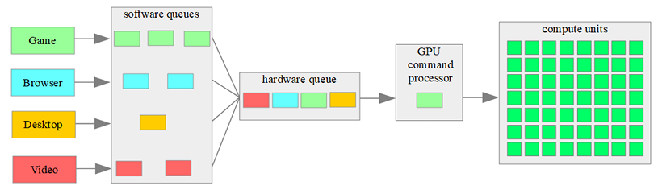
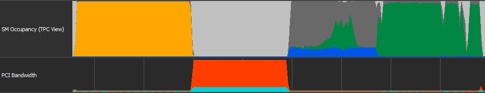
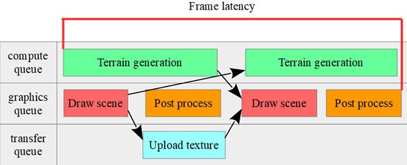

# Tutorial23 - Async Queues

This tutorial demonstrates how to optimize rendering using multiple queues, also known as async compute.

## Queues in desktop GPUs

All GPU commands are recorded to the command buffers, then they are submitted to one of the queues (VkQueue, ID3D12CommandQueue, MTLCommandQueue), which is just an API for the driver, and then these commands are executed on the GPU.
But what is the path of GPU commands before they start executing on compute units?

We have only a software queue, which is controlled by the driver, there can be a lot of them.
Each application which uses GPU, like a game, browser, video player and even a desktop, has their own software queue or multiple queues.



The GPU driver receives multiple commands from multiple queues, but then all commands processed by a single command processor, which is distributed workload on compute units.
Command processor can execute in parallel only a small number of commands which have no dependencies between them, for example: some compute and copy commands or single render pass with multiple draw calls.
The large workload from one application will cause a slow down of other applications which are using GPU. But GPU driver and hardware may divide commands from a single application to small blocks and alternately execute blocks from different applications.
This allows applications with low workload like a browser or video player to render in 60FPS when a game with high workload executes just in 10 FPS.
Current hardware has limitations that do not allow it to run render pass in parallel with compute, copy or another render pass.
But a separate command processor can execute any command in parallel with the main command processor.
Current hardware has a single graphics processor, multiple compute command processors and some transfer command processors.


As opposed to CPU, the GPU will always use as many compute units as possible, so when you use an async compute queue you don't unlock any secret power of GPU. Then what is the point of parallelization?
In an ideal renderer each command occupies all compute units or runs in parallel with further commands and together occupies all compute units.
But in real renderer this is newer happens for many reasons:
* GPU waits for new commands from CPU side or waits for fence signal
* Loading from VRAM to cache, cache misses
* Loading from cache to VRAM, cache flushes
* Uncached access to memory (UAV resources), atomic operations
* Memory bandwidth
* PCI-E bandwidth
* Suboptimal synchronizations between commands (state transitions)
* Decompression of the compressed render targets
* Peak performance of the fixed pipeline (triangle culling and rasterization, tessellation, ray-triangle intersection and other)
* Frequent state changes (see 'Understanding GPU context rolls')
* Poorly prepared geometry (one-pixel or elongated triangles)


*Image from NSight GPUTrace. Light gray areas - idle cores, dark gray - unused warps (because of culled and one-pixel triangles).*

Modern GPUs have a very good workload distribution which can hide latency of some operations.
Also, you can optimize your application to minimize GPU stalls, but you will not be able to get rid of GPU stalls completely, so some part of GPU power will not be used in a single queue and will be available for other queues.


## Queues in mobile GPUs

Initially mobile devices were designed to execute render commands from a single application.
Mobile devices use a tile based deferred renderer (TBDR): at first processed all geometry in render pass, then it divides to tiles, then each triangle in a tile will be rasterized and fragment shader will be executed.

Modern ARM GPUs have a two or three hardware queues:
1. Vertex shader and binning on tiles.
2. Triangle rasterization and fragment shader execution.
3. Compute shader execution, on two queue configuration compute shaders executed in the same queue as vertex shaders.

Each hardware queue may run in parallel with others but they share the same compute units.


Low-end devices have just 1-4 GPU cores with 32 threads each, because of this, commands are most often executed sequentially and the cores are rarely idle, so there are no advantages from parallelization.
The high-end devices may have 8-16 GPU cores which add the ability to parallelise some workload if there is no dependency between them.

Graphics API (Vulkan and Metal) may have some software queues, this allows to use async compute techniques on mobile devices, but because all software queues use the same hardware queues, performance of these techniques depends on driver efficiency.


## Tutorial overview

In tutorial we have 4 passes:
1. Terrain generation in compute shader. Noise generation will loads the arithmetic units, there is no texture or buffer loads, so compute units will not stall and occupation is very high.
In real application this may be a water simulation, physics simulations, occlusion culling and other.
This pass can be executed in an async compute queue.
2. Texture atlas uploading. Textures for buildings updated on the CPU side and uploaded to GPU.
In real applications this may be a resource streaming for an open world game, virtual texture update, high mipmap streaming and other.
This pass can be executed in an async transfer queue and enabled only if the transfer queue is supported by device.
3. Scene rendering. Here we draw terrain and buildings, using the same resources as in passes 1 and 2.
4. Post processing. Here we render mipmaps from color render target to make a glow effect, apply fog and make a final pass to swapchain image.
Resources from passes 1 and 2 are not used, so these passes can run in parallel.


For runtime profiling we use timestamp queries. Accuracy of timestamp queries is hardware dependent, also it may prevent commands for overlapping.
For precise profiling you should use specialized tools from hardware vendors.

In the profiler we have two important intervals: frame time and time between two graphics passes.

1. Frame time. When using multiple queues, compute and upload passes may overlap with post process pass in the previous frame, so frame time will increase, but frame rate increased too.
Instead of a single queue renderer we cannot use frame time to measure performance, but frame time shows a frame latency - time between command submission on CPU side and submitting final image to present engine.
Action games and VR applications require a low frame latency and overlapping with previous frame is not a good solution for this kind of applications.


2. Time between two graphics passes. Graphics passes are not overlapped, so this is the correct way to measure frame rate on the GPU, but vertical synchronization may add GPU idle time to this interval.


Sliders and flags used to change workload on different passes:
* Transfer rate per frame - how much texture array slices will be updated in a single frame. This affects the upload pass time, additionally we calculate the transfer rate - how much data will be sent through a PCI-E bus per second.
* Use async transfer - execute upload pass in the transfer queue.
* Terrain dimension - size of the height and normal map for terrain, this slider affects the compute pass time and partially the graphics pass time, because the number of triangles and memory loads will increase.
* Use async compute - execute compute pass in the compute queue.
* Double buffering - changes the compute to graphics synchronization method, compute pass will overlap with all graphics commands in previous pass which increases the frame latency.



* Surface scale - changes the render target size, it allows you to manage how much fragment shader invocations will be in graphics pass, but geometry processing will be the same. For post process pass it has much more effect - pass time will increase exponentially.
* Glow - enable glow effect, it requires downsampling which is very memory bound, but it allows other queues to overlap.


Desktop GPUs have performance improvements of overlapping compute and upload passes with post process pass of the previous frame.
The double buffered mode is faster but with the cost of increased frame latency. In some uncommon cases we may have 2 times performance improvements.

On low-end mobile GPUs with a small number of cores we have no advantages of using async compute.
On high-end mobile GPUs we don't have any improvements of overlapping post process pass with compute pass, but in double buffering mode overlapping of scene drawing pass with compute pass has performance improvements to 1.5 times.
This happens because scene rendering is not efficient and many compute units are not used because geometry is not frustum culled and LODs are not used.


## Engine initialization

Multiple queues are supported in DirectX 12, Vulkan and Metal backends.
To enable multiple queues we should rewrite engine initialization code.

After creating the engine factory we use `EnumerateAdapters()` to find an adapter which supports multiple queues.
```cpp
Uint32 NumAdapters = 0;
pEngineFactory->EnumerateAdapters(EngineCI.GraphicsAPIVersion, NumAdapters, 0);
if (NumAdapters > 0)
{
    std::vector<GraphicsAdapterInfo> Adapters;
    Adapters.resize(NumAdapters);
    pEngineFactory->EnumerateAdapters(EngineCI.GraphicsAPIVersion, NumAdapters, Adapters.data());

    EngineCI.AdapterId = 0;
    Uint32 NumQueues   = 0;
    for (Uint32 AdapterId = 0; AdapterId < NumAdapters; ++AdapterId)
    {
        auto& Adapter = Adapters[AdapterId];
        if (Adapter.NumQueues > NumQueues)
        {
            EngineCI.AdapterId = AdapterId;
            NumQueues          = Adapter.NumQueues;
        }
    }
}
```

Then we use the helper function `AddContext ()` to find the required queue and add it to context create info.
```cpp
std::vector<ImmediateContextCreateInfo> ContextCI;

auto AddContext = [&](COMMAND_QUEUE_TYPE Type, const char* Name, Uint32 AdapterId)
{
    constexpr auto QueueMask = COMMAND_QUEUE_TYPE_PRIMARY_MASK;
    auto*          Queues    = Adapters[AdapterId].Queues;
    for (Uint32 q = 0, Count = Adapters[AdapterId].NumQueues; q < Count; ++q)
    {
        auto& CurQueue = Queues[q];
        if (CurQueue.MaxDeviceContexts == 0)
            continue;

        if ((CurQueue.QueueType & QueueMask) == Type)
        {
            CurQueue.MaxDeviceContexts -= 1;

            ImmediateContextCreateInfo Ctx{};
            Ctx.QueueId  = static_cast<Uint8>(q);
            Ctx.Name     = Name;
            Ctx.Priority = QUEUE_PRIORITY_MEDIUM;
            ContextCI.push_back(Ctx);
            return true;
        }
    }
    return false;
};
AddContext(COMMAND_QUEUE_TYPE_GRAPHICS, "Graphics", EngineCI.AdapterId);
AddContext(COMMAND_QUEUE_TYPE_TRANSFER, "Transfer", EngineCI.AdapterId);

// On Metal and Vulkan mobile platforms we have only graphics queues.
if (!AddContext(COMMAND_QUEUE_TYPE_COMPUTE, "Compute", EngineCI.AdapterId))
    AddContext(COMMAND_QUEUE_TYPE_GRAPHICS, "Graphics 2", EngineCI.AdapterId);
        
EngineCI.pImmediateContextInfo = ContextCI.data();
EngineCI.NumImmediateContexts  = static_cast<Uint32>(ContextCI.size());
```
Default queue priority is `MEDIUM`, highest priorities may require additional system privileges.


To synchronize between queues we need to create a fence with `GENERAL` type.
```cpp
FenceDesc FenceCI;
FenceCI.Type = FENCE_TYPE_GENERAL;

FenceCI.Name = "Graphics context fence";
m_pDevice->CreateFence(FenceCI, &m_GraphicsCtxFence);

FenceCI.Name = "Compute context fence";
m_pDevice->CreateFence(FenceCI, &m_ComputeCtxFence);
```


## Use async compute queue

In the async compute queue we use terrain height and normal map.
Texture creation has a small update, now we need to set up `ImmediateContextMask`, it indicates for which immediate contexts we can use resource.
We will use textures in graphics and compute contexts.

```cpp
TextureDesc TexDesc;
TexDesc.Name                 = "Terrain height map";
...
TexDesc.ImmediateContextMask = (1ull << m_pImmediateContext->GetDesc().ContextId) | (1ull << m_ComputeCtx->GetDesc().ContextId);
m_Device->CreateTexture(TexDesc, nullptr, &m_HeightMap);

TexDesc.Name = "Terrain normal map";
m_Device->CreateTexture(TexDesc, nullptr, &m_NormalMap);
```

For multiple queues automatic state transition is not supported, so transit state to UAV and disable automatic transitions by setting UNKNOWN state.
```cpp
const StateTransitionDesc Barriers[] = {
    {m_HeightMap, RESOURCE_STATE_UNKNOWN, RESOURCE_STATE_UNORDERED_ACCESS},
    {m_NormalMap, RESOURCE_STATE_UNKNOWN, RESOURCE_STATE_UNORDERED_ACCESS}
};
pContext->TransitionResourceStates(_countof(Barriers), Barriers);

m_HeightMap->SetState(RESOURCE_STATE_UNKNOWN);
m_NormalMap->SetState(RESOURCE_STATE_UNKNOWN);
```

Compute pass will use resources in UAV state, but for drawing we need to transit texture state into SRV.
If we make it in the compute context then graphics stages will be unaffected which may cause undefined behaviour.

<details>
<summary>Detailed explanation</summary>
In Vulkan UAV to SRV barrier in the compute queue will looks like:

```cpp
VkImageMemoryBarrier Barrier;
Barrier.oldLayout     = VK_IMAGE_LAYOUT_GENERAL;
Barrier.newLayout     = VK_IMAGE_LAYOUT_SHADER_READ_ONLY_OPTIMAL;
Barrier.srcAccessMask = VK_ACCESS_SHADER_WRITE_BIT;
Barrier.dstAccessMask = VK_ACCESS_SHADER_READ_BIT;
vkCmdPipelineBarrier(..., VK_PIPELINE_STAGE_COMPUTE_SHADER_BIT, VK_PIPELINE_STAGE_COMPUTE_SHADER_BIT, ..., &Barrier, ...);
```

But correct barrier must include graphics stages (`VK_PIPELINE_STAGE_VERTEX_SHADER_BIT | VK_PIPELINE_STAGE_FRAGMENT_SHADER_BIT`) which is allowed only in graphics queue.

In DirectX 12 UAV to SRV barrier in the compute queue will looks like:

```cpp
D3D12_RESOURCE_BARRIER Barrier;
Barrier.Type                   = D3D12_RESOURCE_BARRIER_TYPE_TRANSITION;
Barrier.Transition.StateBefore = D3D12_RESOURCE_STATE_UNORDERED_ACCESS;
Barrier.Transition.StateAfter  = D3D12_RESOURCE_STATE_NON_PIXEL_SHADER_RESOURCE;
```

But the correct state must include `D3D12_RESOURCE_STATE_PIXEL_SHADER_RESOURCE` which is allowed only in graphics queue.

</details>

State transition inside render pass will split it on two passes which is slow on mobile devices.
For optimization we make all transitions before and after scene rendering.
```cpp
void Terrain::BeforeDraw(IDeviceContext* pContext)
{
    const StateTransitionDesc Barriers[] = {
        {m_HeightMap, RESOURCE_STATE_UNORDERED_ACCESS, RESOURCE_STATE_SHADER_RESOURCE},
        {m_NormalMap, RESOURCE_STATE_UNORDERED_ACCESS, RESOURCE_STATE_SHADER_RESOURCE}
    };
    pContext->TransitionResourceStates(_countof(Barriers), Barriers);
}

void Terrain::AfterDraw(IDeviceContext* pContext)
{
    const StateTransitionDesc Barriers[] = {
        {m_HeightMap, RESOURCE_STATE_SHADER_RESOURCE, RESOURCE_STATE_UNORDERED_ACCESS},
        {m_NormalMap, RESOURCE_STATE_SHADER_RESOURCE, RESOURCE_STATE_UNORDERED_ACCESS}
    };
    pContext->TransitionResourceStates(_countof(Barriers), Barriers);
}
```

Read and write access to the textures must be synchronized via fence.
```cpp
// Compute context waits for previous graphics pass
m_ComputeCtx->DeviceWaitForFence(m_GraphicsCtxFence, m_GraphicsCtxFenceValue);

m_Terrain.Update(m_ComputeCtx);

// Notify that compute pass is complete
m_ComputeCtx->EnqueueSignal(m_ComputeCtxFence, ++m_ComputeCtxFenceValue);

// Submit commands to the GPU
m_ComputeCtx->Flush();

// Graphics pass will wait for compute pass
m_pImmediateContext->DeviceWaitForFence(m_ComputeCtxFence, m_ComputeCtxFenceValue);
```

Compute pipeline state may be used in graphics and compute context depending on whether the async compute is active.
`ImmediateContextMask` must be initialized to be compatible with graphics and compute contexts.
```cpp
ComputePipelineStateCreateInfo PSOCreateInfo;
PSOCreateInfo.PSODesc.ImmediateContextMask = (1ull << m_pImmediateContext->GetDesc().ContextId) | (1ull << m_ComputeCtx->GetDesc().ContextId);
m_Device->CreateComputePipelineState(PSOCreateInfo, &m_GenPSO);
```


## Use async transfer queue

In the async transfer queue we use texture atlas for buildings.
Initialization is the same as for terrain textures, we just set up `ImmediateContextMask` for graphics and transfer immediate contexts.
```cpp
TextureDesc TexDesc;
TexDesc.Name                 = "Buildings texture atlas";
TexDesc.ImmediateContextMask = (1ull << m_pImmediateContext->GetDesc().ContextId) | (1ull << m_TransferCtx->GetDesc().ContextId);
m_Device->CreateTexture(TexDesc, nullptr, &m_OpaqueTexAtlas);
```

Vulkan and DirectX 12 have different requirements for state transition.<br/>
In Vulkan we use state transition: in graphics queue initial state is `COPY_DEST` we thansit it to `SHADER_RESOURCE` and back to `COPY_DEST` at the end of drawing, in transfer queue state is always `COPY_DEST`.<br/>
In DirectX 12 when a resource transitioned from graphics or compute queue to transfer queue resource must be in `COMMON` state, so we use a bit complex transitions: in transfer queue initial state is `COMMON`, then we transit it to `COPY_DEST` and back to `COMMON` at the end of upload pass, in graphics queue initial state is `COMMON` too, then we transit it to `SHADER_RESOURCE` and back to `COMMON`.
```cpp
m_OpaqueTexAtlasDefaultState = RESOURCE_STATE_COPY_DEST;
        
if (m_Device->GetDeviceInfo().Type == RENDER_DEVICE_TYPE_D3D12)
    m_OpaqueTexAtlasDefaultState = RESOURCE_STATE_COMMON;
            
const StateTransitionDesc Barrier = {m_OpaqueTexAtlas, RESOURCE_STATE_UNKNOWN, m_OpaqueTexAtlasDefaultState};
pContext->TransitionResourceStates(1, &Barrier);
        
m_OpaqueTexAtlas->SetState(RESOURCE_STATE_UNKNOWN);
```

Same as for the compute queue, we must transit to `SHADER_RESOURCE` in the graphics queue to avoid undefined behaviour.
```cpp
void Buildings::BeforeDraw(IDeviceContext* pContext)
{
    const StateTransitionDesc Barrier{m_OpaqueTexAtlas, m_OpaqueTexAtlasDefaultState, RESOURCE_STATE_SHADER_RESOURCE};
    pContext->TransitionResourceStates(1, &Barrier);
}

void Buildings::AfterDraw(IDeviceContext* pContext)
{
    const StateTransitionDesc Barrier{m_OpaqueTexAtlas, RESOURCE_STATE_SHADER_RESOURCE, m_OpaqueTexAtlasDefaultState};
    pContext->TransitionResourceStates(1, &Barrier);
}
```

For the DirectX backend we add transitions from `COMMON` state.
```cpp
void Buildings::UpdateAtlas(IDeviceContext* pContext)
{
    if (m_OpaqueTexAtlasDefaultState != RESOURCE_STATE_COPY_DEST)
    {
        const StateTransitionDesc Barrier{m_OpaqueTexAtlas, m_OpaqueTexAtlasDefaultState, RESOURCE_STATE_COPY_DEST};
        pContext->TransitionResourceStates(1, &Barrier);
    }
    
    pContext->CopyTexture(...);
    
    if (m_OpaqueTexAtlasDefaultState != RESOURCE_STATE_COPY_DEST)
    {
        const StateTransitionDesc Barrier{m_OpaqueTexAtlas, RESOURCE_STATE_COPY_DEST, m_OpaqueTexAtlasDefaultState};
        pContext->TransitionResourceStates(1, &Barrier);
    }
}
```

Read and write access to the texture must be synchronized via fence.
```cpp
// Transfer context waits for previous graphics pass
m_TransferCtx->DeviceWaitForFence(m_GraphicsCtxFence, m_GraphicsCtxFenceValue);

m_Buildings.UpdateAtlas(m_TransferCtx, ...);

// Notify that upload pass is complete
m_TransferCtx->EnqueueSignal(m_TransferCtxFence, ++m_TransferCtxFenceValue);

// Submit commands to the GPU
m_TransferCtx->Flush();

// Graphics pass will wait for upload pass
m_pImmediateContext->DeviceWaitForFence(m_TransferCtxFence, m_TransferCtxFenceValue);
```


## Graphics queue

For graphics context we just add fence wait and signal commands to synchronize with other queues.
```cpp
// Graphics pass will wait for upload pass
m_pImmediateContext->DeviceWaitForFence(m_TransferCtxFence, m_TransferCtxFenceValue);

// Graphics pass will wait for compute pass
m_pImmediateContext->DeviceWaitForFence(m_ComputeCtxFence, m_ComputeCtxFenceValue);

// Graphics pass
...

// Graphics pass complete
m_pImmediateContext->EnqueueSignal(m_GraphicsCtxFence, ++m_GraphicsCtxFenceValue);
```


## Further Reading

[Breaking Down Barriers - Part 3: Multiple Command Processors](https://therealmjp.github.io/posts/breaking-down-barriers-part-3-multiple-command-processors/)<br/>
[Using Compute Post-Processing in Vulkan on Mali](https://community.arm.com/developer/tools-software/graphics/b/blog/posts/using-compute-post-processing-in-vulkan-on-mali)<br/>
[Using asynchronous compute on Arm Mali GPUs](https://community.arm.com/developer/tools-software/graphics/b/blog/posts/using-asynchronous-compute-on-arm-mali-gpus)<br/>
[Pass overlapping in Metal](https://developer.apple.com/videos/play/wwdc2020/10632/?time=258) - video (4:19 - 9:00) <br/>
[Multi-engine synchronization](https://docs.microsoft.com/en-us/windows/win32/direct3d12/user-mode-heap-synchronization)<br/>
[Understanding GPU context rolls](https://gpuopen.com/learn/understanding-gpu-context-rolls/)<br/>
[Hardware Accelerated GPU Scheduling](https://devblogs.microsoft.com/directx/hardware-accelerated-gpu-scheduling/)<br/>
