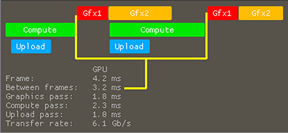

# Tutorial23 - Command Queues

This tutorial demonstrates how to use multiple command queues to perform rendering in parallel with copy and compute operations.


## Command Queues in Desktop GPUs

When CPU issues a command (render, compute, copy, etc.), it is not executed immediately by the GPU. Instead,
it is recorded into a command buffer. When the buffer contains enough commands, it is submitted to the command queue
(VkQueue, ID3D12CommandQueue, MTLCommandQueue), which is then passed to the driver, that schedules them to be executed on the GPU.
But what is the path of GPU commands before they get executed on compute units?

An application can only access *software* command queues provided by the driver.
Each application that uses GPU, like a game, browser, video player and even the desktop, sees their own software queues.


The GPU driver receives multiple command lists from multiple queues, but then all commands are processed by the single command processor
that distributes workload across compute units. The command processor can execute in parallel only a small number of commands that have no
dependencies between them, for example: some compute and copy commands or a single render pass with multiple draw calls.
A large workload from one application will cause a slow down of other applications that are using the GPU. But the GPU driver and the hardware may
divide command buffers from a single application into small chunks and alternately execute chunks from different applications.
This allows applications with low workload like a browser or a video player to render at 60 FPS when a game with high workload runs at just 10 FPS.
Current hardware has limitations that do not allow it to run render pass in parallel with compute, copy or another render pass on the same command processor.
But a separate command processor can execute any command in parallel with the main command processor.
Current hardware typically has a single graphics processor, multiple compute command processors and some transfer command processors.


As opposed to CPU, the GPU always uses as many compute units as possible, so when we use async compute queue, we don't unlock any
secret power of GPU. Then what is the point of parallelization?
In an ideal renderer each command occupies all compute units or runs in parallel with further commands and together uses GPU by 100%.
But in real renderer this never happens for many reasons:
* GPU waits for new commands from CPU or waits for the fence signal and has no work to do
* Loading from VRAM to cache, cache misses stall execution units
* Loading from cache to VRAM, cache flushes
* Uncached access to memory (UAV resources), atomic operations
* Memory bandwidth
* PCI-E bandwidth
* Suboptimal synchronizations between commands (state transitions)
* Decompression of the compressed render targets
* Peak performance of the fixed pipeline (triangle culling and rasterization, tessellation, ray-triangle intersection and other)
* Frequent state changes (see 'Understanding GPU context rolls')
* Poorly prepared geometry (one-pixel or elongated triangles)


*Image from NSight GPUTrace. Light gray areas - idle cores, dark gray - unused warps (because of culled and one-pixel triangles).*

Modern GPUs perform a very good workload distribution which can hide latency of some operations.
Also, you can optimize your application to minimize GPU stalls, but you will not be able to get rid of GPU stalls completely,
so some part of GPU power will not be used in a single queue and will be available for other queues.


## Command Queues in Mobile GPUs

Initially mobile devices were designed to execute render commands from a single application.
Mobile devices use a tile based deferred renderer (TBDR): all geometry in a render pass is first processed and triangles are assigned to
screen-space tiles (also called bins). Each tile is the processed independently and fragment shaders are only executed for triangles in the tile.

Modern ARM GPUs have two or three hardware queues:
1. Vertex shader and binning on tiles.
2. Triangle rasterization and fragment shader execution.
3. Compute shader execution. In a two-queue configuration, compute shaders are executed in the same queue as vertex shaders.

Each hardware queue may run in parallel with others but they share the same compute units.


Low-end devices have just 1-4 GPU cores with 32 threads each. Because of this, commands are most often executed sequentially and
the cores are rarely idle, so there are no advantages from parallelization.
High-end devices may have 8-16 GPU cores that add the ability to parallelise some workload if there is no dependency between them.

Graphics API (Vulkan and Metal) expose multiple software queues that allow using async compute techniques on mobile devices,
but because all software queues use the same hardware queues, performance of these techniques depends on the driver efficiency.


## Tutorial Overview

This tutorial implements a simple asynchronous renderer that consists of 4 passes:

1. *Terrain generation in compute shader*.
    This is a compute-heavy pass that keeps compute units busy with lots of noise generation operations. There are no texture
    or buffer loads, so compute units do not stall on memory access and occupation is very high. In a real application, a compute
    pass may perform water simulation, physics simulations, occlusion culling and other. This pass can be executed in an async
    compute queue.

2. *Texture atlas uploading*.
    Textures for buildings are updated on the CPU and are uploaded to GPU. A real applications may be performing resource streaming
    for an open world game, virtual texture update, high mipmap streaming and other tasks. This pass can be executed in an async transfer
    queue and is only enabled if the transfer queue is supported by device.

3. *Scene rendering*.
    In this pass we draw the terrain and buildings, using the resources prepared in passes 1 and 2.

4. *Post processing*.
    In this pass we generate mipmaps from color render targets generated in pass 3 to make glow effect, apply fog and generate the
    final image that is presented on the screen. Resources from passes 1 and 2 are not used, so these operations can run in parallel.


For the runtime profiling, we use timestamp queries. Note that accuracy of timestamp queries is hardware-dependent and, more importantly,
using queries may prevent commands from overlapping.
For precise profiling you should use specialized tools from hardware vendors.

In the profiler we have two important intervals: the frame time and the time between two graphics passes.

1. *The frame time.*
   When using multiple queues, compute and upload passes may overlap with the post process pass in the previous frame,
   so single frame time increases. However, since two frames are in flight, the frame rate increased too.
   As opposed to a single-queue renderer, we cannot use the frame time to measure performance, but the frame time shows frame latency,
   e.g. the time between command submission on the CPU and the time when the final image is handled by the presentantion engine.
   Action games and VR applications require low frame latency and overlapping with the previous frame may add extra latency, which may be
   undesirable.


2. *The time between two graphics passes.*
   Graphics passes do not overlap, so this is the correct way to measure the frame rate on the GPU. Note that the vertical synchronization may add
   GPU idle time to this interval.



Sliders and flags are used to control the workload in different passes:

* *Transfer rate per frame* - controls how many texture array slices will be updated in a single frame.
  This affects the upload pass time. Additionally, we calculate the transfer rate, i.e. how much data will be sent through the PCI-E bus per second.
* *Use async transfer* - controls whether to execute upload pass in the transfer queue.
* *Terrain dimension* - the size of the height and normal maps for terrain. This slider affects the
  compute pass time and partially the graphics pass time since the number of triangles and memory loads depend on the terrain resolution.
* *Use async compute* - controls whether to execute compute pass in a separate compute queue.
* *Double buffering* - changes the compute to graphics synchronization method. With double buffering, the compute pass overlaps with all graphics commands
   in the previous pass, which increases the frame latency.


* *Surface scale* - changes the render target size. It controls how many fragment shader invocations will be in the graphics pass,
  but geometry processing will always be the same. This has a major effect on the performance of the post process pass - the pass
  time increases exponentially.
* *Glow* - whether to enable glow effect. The effect requires downsampling, a severely memory-bound process, but it allows other queues to overlap.


Desktop GPUs allow better overlapping of compute and upload passes with post process pass of the previous frame.
The double-buffered mode is faster, but for the price of increased frame latency. As much as 2x performance improvement may be achieved.

On low-end mobile GPUs with a small number of cores, using async compute gives no advantage.
On high-end mobile GPUs, overlapping post-process pass with compute pass does not give any improvement, but double-buffering mode allows overlapping the
scene drawing pass with the compute pass that results in up to 1.5x performance improvement.
Note that in this tutorial we don't perform frustum culling and don't use LODs. This uses many compute units and simulates a complex geometry processing.


## Engine Initialization

Diligent Engine supports multiple command queues in DirectX 12, Vulkan and Metal backends.
To enable multiple queues, we should first find the suitable adapter.
After creating the engine factory, we use the `EnumerateAdapters()` method to get the list of adapters.

```cpp
std::vector<GraphicsAdapterInfo> Adapters;

Uint32 NumAdapters = 0;
pEngineFactory->EnumerateAdapters(EngineCI.GraphicsAPIVersion, NumAdapters, 0);
if (NumAdapters > 0)
{
    Adapters.resize(NumAdapters);
    pEngineFactory->EnumerateAdapters(EngineCI.GraphicsAPIVersion, NumAdapters, Adapters.data());

    EngineCI.AdapterId = 0;
    Uint32 NumQueues   = 0;
    for (Uint32 AdapterId = 0; AdapterId < NumAdapters; ++AdapterId)
    {
        auto& Adapter = Adapters[AdapterId];
        if (Adapter.NumQueues > NumQueues)
        {
            EngineCI.AdapterId = AdapterId;
            NumQueues          = Adapter.NumQueues;
        }
    }
}
```

In Diligent Engine, command queues are exposed through immediate contexts. An immediate context allows recording commands
directly, or executing command lists recorded by the deferred contexts. Every immediate context encompasses a single software queue.

We use a helper function `AddContext()` to find the required queue and add it to the context create info.

```cpp
std::vector<ImmediateContextCreateInfo> ContextCI;

auto AddContext = [&](COMMAND_QUEUE_TYPE Type, const char* Name, Uint32 AdapterId)
{
    constexpr auto QueueMask = COMMAND_QUEUE_TYPE_PRIMARY_MASK;
    auto*          Queues    = Adapters[AdapterId].Queues;
    for (Uint32 q = 0, Count = Adapters[AdapterId].NumQueues; q < Count; ++q)
    {
        auto& CurQueue = Queues[q];
        if (CurQueue.MaxDeviceContexts == 0)
            continue;

        if ((CurQueue.QueueType & QueueMask) == Type)
        {
            CurQueue.MaxDeviceContexts -= 1;

            ImmediateContextCreateInfo Ctx{};
            Ctx.QueueId  = static_cast<Uint8>(q);
            Ctx.Name     = Name;
            Ctx.Priority = QUEUE_PRIORITY_MEDIUM;
            ContextCI.push_back(Ctx);
            return true;
        }
    }
    return false;
};
AddContext(COMMAND_QUEUE_TYPE_GRAPHICS, "Graphics", EngineCI.AdapterId);
AddContext(COMMAND_QUEUE_TYPE_TRANSFER, "Transfer", EngineCI.AdapterId);

// On Metal and Vulkan mobile platforms we have only graphics queues.
if (!AddContext(COMMAND_QUEUE_TYPE_COMPUTE, "Compute", EngineCI.AdapterId))
    AddContext(COMMAND_QUEUE_TYPE_GRAPHICS, "Graphics 2", EngineCI.AdapterId);
        
EngineCI.pImmediateContextInfo = ContextCI.data();
EngineCI.NumImmediateContexts  = static_cast<Uint32>(ContextCI.size());
```

Default queue priority is `MEDIUM`. Note that higher priorities may require additional system privileges.


To synchronize between queues, we need to create fences.
A fence is a synchronization object that can be signaled in one queue and waited upon in another.
Diligent Engine supports two fence type. A basic fence only allows synchronization between CPU
and GPU. `GENERAL` fence allows GPU-side synchronization between command queues.

```cpp
FenceDesc FenceCI;
FenceCI.Type = FENCE_TYPE_GENERAL;

FenceCI.Name = "Graphics context fence";
m_pDevice->CreateFence(FenceCI, &m_GraphicsCtxFence);

FenceCI.Name = "Compute context fence";
m_pDevice->CreateFence(FenceCI, &m_ComputeCtxFence);
```


## Using the Async Compute Queue

In the async compute queue, we execute the terrain height and normal map generation shader.

Creating the height and normal map textures is done similar to other tutorials with one difference:
we need to set up `ImmediateContextMask`. This member indicates in which immediate contexts we can use
the resource. We will use the textures in the graphics and compute contexts.

```cpp
TextureDesc TexDesc;
TexDesc.Name                 = "Terrain height map";
...
TexDesc.ImmediateContextMask =
    (Uint64{1} << m_pImmediateContext->GetDesc().ContextId) |
    (Uint64{1} << m_ComputeCtx->GetDesc().ContextId);
m_Device->CreateTexture(TexDesc, nullptr, &m_HeightMap);

TexDesc.Name = "Terrain normal map";
m_Device->CreateTexture(TexDesc, nullptr, &m_NormalMap);
```

For multiple queues, automatic state transition is not supported, so we manually transition the texture state to UAV and
disable automatic transitions by setting the texture state to UNKNOWN:

```cpp
const StateTransitionDesc Barriers[] = {
    {m_HeightMap, RESOURCE_STATE_UNKNOWN, RESOURCE_STATE_UNORDERED_ACCESS},
    {m_NormalMap, RESOURCE_STATE_UNKNOWN, RESOURCE_STATE_UNORDERED_ACCESS}
};
pContext->TransitionResourceStates(_countof(Barriers), Barriers);

m_HeightMap->SetState(RESOURCE_STATE_UNKNOWN);
m_NormalMap->SetState(RESOURCE_STATE_UNKNOWN);
```

Compute pass will use resources in the UAV state, but for rendering we need to transit the texture state into SRV.
If we make it in the compute context, then graphics stages will be unaffected which may cause undefined behaviour.

<details>
<summary>Detailed explanation</summary>

In Vulkan, a UAV to SRV barrier in the compute queue looks like this:

```cpp
VkImageMemoryBarrier Barrier;
Barrier.oldLayout     = VK_IMAGE_LAYOUT_GENERAL;
Barrier.newLayout     = VK_IMAGE_LAYOUT_SHADER_READ_ONLY_OPTIMAL;
Barrier.srcAccessMask = VK_ACCESS_SHADER_WRITE_BIT;
Barrier.dstAccessMask = VK_ACCESS_SHADER_READ_BIT;
vkCmdPipelineBarrier(..., VK_PIPELINE_STAGE_COMPUTE_SHADER_BIT, VK_PIPELINE_STAGE_COMPUTE_SHADER_BIT, ..., &Barrier, ...);
```

However, correct barrier must include graphics stages (`VK_PIPELINE_STAGE_VERTEX_SHADER_BIT | VK_PIPELINE_STAGE_FRAGMENT_SHADER_BIT`),
which is only allowed in graphics queue.

In DirectX 12, a UAV to SRV barrier in the compute queue looks like this:

```cpp
D3D12_RESOURCE_BARRIER Barrier;
Barrier.Type                   = D3D12_RESOURCE_BARRIER_TYPE_TRANSITION;
Barrier.Transition.StateBefore = D3D12_RESOURCE_STATE_UNORDERED_ACCESS;
Barrier.Transition.StateAfter  = D3D12_RESOURCE_STATE_NON_PIXEL_SHADER_RESOURCE;
```

However, correct state must include `D3D12_RESOURCE_STATE_PIXEL_SHADER_RESOURCE`, which is only allowed in graphics queue.

</details>

State transition inside the render pass splits the pass into two passes, which is suboptimal on mobile devices.
To avoid this, we make all transitions before and after the scene rendering:

```cpp
void Terrain::BeforeDraw(IDeviceContext* pContext)
{
    const StateTransitionDesc Barriers[] = {
        {m_HeightMap, RESOURCE_STATE_UNORDERED_ACCESS, RESOURCE_STATE_SHADER_RESOURCE},
        {m_NormalMap, RESOURCE_STATE_UNORDERED_ACCESS, RESOURCE_STATE_SHADER_RESOURCE}
    };
    pContext->TransitionResourceStates(_countof(Barriers), Barriers);
}

void Terrain::AfterDraw(IDeviceContext* pContext)
{
    const StateTransitionDesc Barriers[] = {
        {m_HeightMap, RESOURCE_STATE_SHADER_RESOURCE, RESOURCE_STATE_UNORDERED_ACCESS},
        {m_NormalMap, RESOURCE_STATE_SHADER_RESOURCE, RESOURCE_STATE_UNORDERED_ACCESS}
    };
    pContext->TransitionResourceStates(_countof(Barriers), Barriers);
}
```

Read and write access to the textures must be explicitly synchronized via fences.

```cpp
// Make compute context wait for the previous graphics pass
m_ComputeCtx->DeviceWaitForFence(m_GraphicsCtxFence, m_GraphicsCtxFenceValue);

m_Terrain.Update(m_ComputeCtx);

// Notify that compute pass is complete
m_ComputeCtx->EnqueueSignal(m_ComputeCtxFence, ++m_ComputeCtxFenceValue);

// Submit commands to the GPU
m_ComputeCtx->Flush();

// Make graphics pass wait for the compute pass to complete
m_pImmediateContext->DeviceWaitForFence(m_ComputeCtxFence, m_ComputeCtxFenceValue);
```

When creating a pipeline state, similar to resource initialization, we need to indicate which contexts it may be used in. 
Our compute PSO may be used in graphics and compute contexts depending on whether the async compute is active.
`ImmediateContextMask` must be initialized to be compatible with the graphics and compute contexts:

```cpp
ComputePipelineStateCreateInfo PSOCreateInfo;
PSOCreateInfo.PSODesc.ImmediateContextMask =
    (Uint64{1} << m_pImmediateContext->GetDesc().ContextId) | 
    (Uint64{1} << m_ComputeCtx->GetDesc().ContextId);
m_Device->CreateComputePipelineState(PSOCreateInfo, &m_GenPSO);
```


## Using Async Transfer Queue

In the async transfer queue, we update the texture atlas for buildings.
The texture initialization is the same as for terrain textures, we only need to set up the the `ImmediateContextMask`
for graphics and transfer immediate contexts:

```cpp
TextureDesc TexDesc;
TexDesc.Name                 = "Buildings texture atlas";
TexDesc.ImmediateContextMask =
    (Uint64{1} << m_pImmediateContext->GetDesc().ContextId) | 
    (Uint64{1} << m_TransferCtx->GetDesc().ContextId);
m_Device->CreateTexture(TexDesc, nullptr, &m_OpaqueTexAtlas);
```

Note that the state transition requirements vary between Vulkan and DirectX 12 .

In Vulkan, the initial resource state in the graphics queue is `COPY_DEST`. We thansition it to `SHADER_RESOURCE`,
and then back to `COPY_DEST` at the end of rendering, so in the transfer queue the resource is always in `COPY_DEST` state.

In DirectX 12, when a resource is transferred from graphics or compute queue to the transfer queue, it must
be in the `COMMON` state. So we have to perform a bit more complex transitions: in the transfer queue, the initial state is `COMMON`,
then we transition it to `COPY_DEST` and back to `COMMON` at the end of the upload pass. In the graphics queue, the initial state
is `COMMON` as well, so we transition it to `SHADER_RESOURCE` and then back to `COMMON`.

```cpp
m_OpaqueTexAtlasDefaultState = RESOURCE_STATE_COPY_DEST;
        
if (m_Device->GetDeviceInfo().Type == RENDER_DEVICE_TYPE_D3D12)
    m_OpaqueTexAtlasDefaultState = RESOURCE_STATE_COMMON;
            
const StateTransitionDesc Barrier = {m_OpaqueTexAtlas, RESOURCE_STATE_UNKNOWN, m_OpaqueTexAtlasDefaultState};
pContext->TransitionResourceStates(1, &Barrier);
        
m_OpaqueTexAtlas->SetState(RESOURCE_STATE_UNKNOWN);
```

Same as with the compute queue, we must transit to `SHADER_RESOURCE` in the graphics queue to avoid undefined behaviour.

```cpp
void Buildings::BeforeDraw(IDeviceContext* pContext)
{
    const StateTransitionDesc Barrier{m_OpaqueTexAtlas, m_OpaqueTexAtlasDefaultState, RESOURCE_STATE_SHADER_RESOURCE};
    pContext->TransitionResourceStates(1, &Barrier);
}

void Buildings::AfterDraw(IDeviceContext* pContext)
{
    const StateTransitionDesc Barrier{m_OpaqueTexAtlas, RESOURCE_STATE_SHADER_RESOURCE, m_OpaqueTexAtlasDefaultState};
    pContext->TransitionResourceStates(1, &Barrier);
}
```

For the DirectX 12 backend, we need to add transitions from `COMMON` state.

```cpp
void Buildings::UpdateAtlas(IDeviceContext* pContext)
{
    if (m_OpaqueTexAtlasDefaultState != RESOURCE_STATE_COPY_DEST)
    {
        const StateTransitionDesc Barrier{m_OpaqueTexAtlas, m_OpaqueTexAtlasDefaultState, RESOURCE_STATE_COPY_DEST};
        pContext->TransitionResourceStates(1, &Barrier);
    }
    
    pContext->CopyTexture(...);
    
    if (m_OpaqueTexAtlasDefaultState != RESOURCE_STATE_COPY_DEST)
    {
        const StateTransitionDesc Barrier{m_OpaqueTexAtlas, RESOURCE_STATE_COPY_DEST, m_OpaqueTexAtlasDefaultState};
        pContext->TransitionResourceStates(1, &Barrier);
    }
}
```

Read and write access to the texture must be synchronized via the fence.

```cpp
// Make transfer context wait for the previous graphics pass
m_TransferCtx->DeviceWaitForFence(m_GraphicsCtxFence, m_GraphicsCtxFenceValue);

m_Buildings.UpdateAtlas(m_TransferCtx, ...);

// Notify that upload pass is complete
m_TransferCtx->EnqueueSignal(m_TransferCtxFence, ++m_TransferCtxFenceValue);

// Submit commands to the GPU
m_TransferCtx->Flush();

// Make graphics pass wait for the upload pass
m_pImmediateContext->DeviceWaitForFence(m_TransferCtxFence, m_TransferCtxFenceValue);
```


## Graphics Queue

For the graphics context, we add the commands to synchronize with other queues.

```cpp
// Make graphics pass wait for the upload pass
m_pImmediateContext->DeviceWaitForFence(m_TransferCtxFence, m_TransferCtxFenceValue);

// Make graphics pass wait for the compute pass
m_pImmediateContext->DeviceWaitForFence(m_ComputeCtxFence, m_ComputeCtxFenceValue);

// Graphics pass
...

// Signal that the graphics pass is complete
m_pImmediateContext->EnqueueSignal(m_GraphicsCtxFence, ++m_GraphicsCtxFenceValue);
```


## Further Reading

[Breaking Down Barriers - Part 3: Multiple Command Processors](https://therealmjp.github.io/posts/breaking-down-barriers-part-3-multiple-command-processors/)<br/>
[Using Compute Post-Processing in Vulkan on Mali](https://community.arm.com/developer/tools-software/graphics/b/blog/posts/using-compute-post-processing-in-vulkan-on-mali)<br/>
[Using asynchronous compute on Arm Mali GPUs](https://community.arm.com/developer/tools-software/graphics/b/blog/posts/using-asynchronous-compute-on-arm-mali-gpus)<br/>
[Pass overlapping in Metal](https://developer.apple.com/videos/play/wwdc2020/10632/?time=258) - video (4:19 - 9:00) <br/>
[Multi-engine synchronization](https://docs.microsoft.com/en-us/windows/win32/direct3d12/user-mode-heap-synchronization)<br/>
[Understanding GPU context rolls](https://gpuopen.com/learn/understanding-gpu-context-rolls/)<br/>
[Hardware Accelerated GPU Scheduling](https://devblogs.microsoft.com/directx/hardware-accelerated-gpu-scheduling/)<br/>
