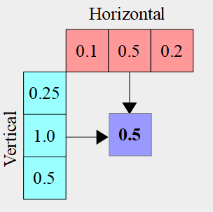

# Tutorial24 - Variable rate shading

This tutorial demonstrates how to use variable rate shading to reduce the pixel shading load.


## VRS on desktop GPUs

Variable rate shading implementations on mobile and desktop GPUs and in different APIs supported by Diligent Engine vary significantly.
On desktop GPUs, variable rate shading is used to change the number of pixel shader invocations per small tile,
which allows reducing the pixel shader load for areas that don't require high quality (e.g. areas that will be smoothed out
by motion blur or depth-of-field, covered by UI, etc.). Direct3D12 and Vulkan support three VRS types that may be combined together:
*per-draw*, *per-primitive*, and *texture-based* rates. They are described below. 

### Per-draw Shading Rate

If `SHADING_RATE_CAP_FLAG_PER_DRAW` capability is supported, a uniform shading rate that will be applied throughout
the entire render target may be set using the `IDeviceContext::SetShadingRate()` method. 
The `BaseRate` parameter must be one of the shading rates supported by the device. All supported rates are listed in
`ShadingRateProperties::ShadingRates` member of the `GraphicsAdapterInfo` struct.
`PrimitiveCombiner` and `TextureCombiner` parameters must be `SHADING_RATE_COMBINER_PASSTHROUGH`.

### Per-primitive Shading Rate

If `SHADING_RATE_CAP_FLAG_PER_PRIMITIVE` capability is supported, shading rate may be specified for each primitive
by using a special vertex or geometry shader output, e.g.:

```hlsl
nointerpolation uint Rate : SV_ShadingRate;
```

Per-primitive rate is combined with the base per-draw rate as specified by the `PrimitiveCombiner` parameter
of the `IDeviceContext::SetShadingRate()` method. The combiner value must be one of the supported combiners in the
`ShadingRateProperties::Combiners` bit field. The two most commonly used combiners are
* `SHADING_RATE_COMBINER_PASSTHROUGH` that defines that per-primitive rate is ignored and the base rate is used instead, and
* `SHADING_RATE_COMBINER_OVERRIDE` that defines that per-primitive rate overrides the base rate.

Other values specify how to combine per-draw base rate with the per-primitive rate.

### Texture-based Shading Rate

If `SHADING_RATE_CAP_FLAG_TEXTURE_BASED` capability is supported, shading rate may be defined using a special texture that for every
pixel on the screen defines the rate. The texture-based rate is combined with the primitive rate, and is applied last.
The combiner for the texture rate is defined by the `TextureCombiner` parameter of the `IDeviceContext::SetShadingRate()`
method. The combiner value must be one of the supported combiners in the `ShadingRateProperties::Combiners` bit field.
If `PrimitiveCombiner` is `SHADING_RATE_COMBINER_PASSTHROUGH` and `TextureCombiner` is `SHADING_RATE_COMBINER_OVERRIDE`,
then only the texture shading rate will be used.

It is possible to use other parameters that define how all three rates are combined.

On desktop GPUs, VRS texture must be created as `RESOURCE_DIM_TEX_2D`, and use `BIND_SHADING_RATE` bind flag.
Its format must be `TEX_FORMAT_R8_UINT` and the size must be less than the render target size divided by `ShadingRateProperties::MinTileSize`.
The way texel values are interpreted depens on the value of `ShadingRateProperties::Format` device property.
On desktop GPUs, this value is typically `SHADING_RATE_FORMAT_PALETTE`, which indicates that
texels contain `SHADING_RATE` enum values.
The texture content can be updated from the CPU or generated in a compute shader. Note that Direct3D12 forbids creating VRS textures with
the render target bind flag, but in Vulkan this may be allowed depending on the implementation.

### Combiners

Shading rate combination algorithm is as follows:

```cpp
SHADING_RATE ApplyCombiner(SHADING_RATE_COMBINER Combiner, SHADING_RATE OriginalRate, SHADING_RATE NewRate)
{
    switch (Combiner)
    {
        case SHADING_RATE_COMBINER_PASSTHROUGH: return OriginalRate;
        case SHADING_RATE_COMBINER_OVERRIDE:    return NewRate;
        case SHADING_RATE_COMBINER_MIN:         return Min(OriginalRate, NewRate);
        case SHADING_RATE_COMBINER_MAX:         return Max(OriginalRate, NewRate);
        case SHADING_RATE_COMBINER_SUM:         return OriginalRate + NewRate;
        case SHADING_RATE_COMBINER_MUL:         return OriginalRate * NewRate;
    }
}
```

`IDeviceContext::SetShadingRate()` sets the `BaseRate` value.<br/>
`SV_ShadingRate` output of a vertex or a geometry shader defines the `PerPrimitiveRate` value and it is combined with the per-draw rate:

`PrimitiveRate = ApplyCombiner(PrimitiveCombiner, BaseRate, PerPrimitiveRate)`

Next, the texel from the VRS texture is read to `TextureRate` and is combined with the primitive rate from the previous step:

`FinalRate = ApplyCombiner(TextureCombiner, PrimitiveRate, TextureRate)`

After that the GPU executes pixel shaders using the `FinalRate` value.

`SHADING_RATE_1X1` means that pixel shader will be executed for all pixels in the tile.
`SHADING_RATE_4X4` means that just one pixel shader per 4x4 pixel block will be executed. Other values define intermediate rates.


## VRS on mobile GPUs

On mobile GPUs, only texture-based VRS is supported.
`ShadingRateProperties::Format` device property is  `SHADING_RATE_FORMAT_UNORM8`, which means that VRS texture must be created with
`RG8_UNORM` format, where R channel defines the pixel shader invocation rate along the X-axis, and G channel is the Y-axis rate.
The value of 1.0 means that pixel shader will be executed for all pixels (`AXIS_SHADING_RATE_1X` counterpart), 
the value of 0.5 specifies that pixel shaders will be executed for every other pixel along the axis (`AXIS_SHADING_RATE_2X` counterpart) and so on.

If `SHADING_RATE_CAP_FLAG_TEXTURE_DEVICE_ACCESS` capability is present, the VRS texture content will be accessed on the GPU side.
If you update VRS texture in a compute shader, the engine can implicitly synchronize access to the VRS texture if automatic state transitions are used.
If the capability is not present, VRS texture is accessed on the CPU side when `IDeviceContext::SetRenderTargetsExt()` or
`IDeviceContext::BeginRenderPass()` are called, and if VRS texture is updated on the GPU side, you need to explicitly synchronize access to the texture
using fences and add double/triple buffering to avoid stalls.

Some GPUs will smooth out transitions between different shading rates, capability SHADING_RATE_CAP_FLAG_ADDITIONAL_INVOCATIONS indicates that.


## VRS in Metal API

Implementation of variable rate shading in Metal is very different compared to Direct3D12 and Vulkan, and requires
special handling from the application:

* Unlike Direct3D12 and Vulkan where only pixel shader is executed at a lower rate, but rasterization is performed
   at the full resolution (in particular, depth testing is performed at full resolution), in Metal everything is downscaled.
   A 2x2 shading rate means that the entire tile is rasterized at 1/2x1/2 resolution, not just the pixel shader.
* Only texture-based shading rate is supported.
* Rasterization rate is not specified by a 2D texture. Instead, a special rasterization map is used that defines 
   rasterization rates for columns and rows. A rasterization rate for the specific tile is given by the row and column
   where it is located. Rows and columns use a single float value in the range 0..1.
   Diligent defines a special shading rate format `SHADING_RATE_FORMAT_COL_ROW_FP32` to indicate this kind of shading rate map.
   A `IRasterizationRateMapMtl` interface is used to work with the rasterization rate map in Metal.

* A rasterization rate map is an immutable object and can't be updated. A new object has to be created to use different rates.
* Rendering with VRS enabled is performed to a reduced-resolution texture, but viewport coordinates must be defined in final resolution.
* A special resolve pass is required to upscale this texture to the full resolution.

The code snippet below shows how a resolve pass may be implemented in Metal:

```cpp
fragment
float4 PSmain(         VSOut                        in          [[stage_in]],   // vertex shader generates a fullscreen triangle
              constant rasterization_rate_map_data& g_RRMData   [[buffer(0)]],  // data copied from the rasterization rate map
                       texture2d<float>             g_Texture   [[texture(0)]]) // intermediate render target
{
    // Sampler with pixel coordinates to access the texture
    constexpr sampler readSampler(coord::pixel, address::clamp_to_zero, filter::nearest);

    rasterization_rate_map_decoder Decoder(g_RRMData);

    // Use screen coordinates in pixels
    float2 uv = in.Pos.xy;

    // Convert from linear to non-linear coordinates
    float2 ScreenPos = Decoder.map_screen_to_physical_coordinates(uv);

    // Resolve intermediate texture into full size texture
    return float4(g_Texture.sample(readSampler, ScreenPos));
}
```


## VRS API in Diligent Engine

Variable rate shading feature must be enabled during the engine initialization:

```cpp
Attribs.EngineCI.Features.VariableRateShading = DEVICE_FEATURE_STATE_ENABLED;
```

A graphics PSO that will be used with VRS must set the appropriate `ShadingRateFlags` field in its description.<br/>
A PSO that uses per-draw or per-primitive rates must be created with the `PIPELINE_SHADING_RATE_FLAG_PER_PRIMITIVE` flag.<br/>
A PSO that using texture-based VRS must be created with the `PIPELINE_SHADING_RATE_FLAG_TEXTURE_BASED` flag.
Note that combination of `PIPELINE_SHADING_RATE_FLAG_PER_PRIMITIVE` and `PIPELINE_SHADING_RATE_FLAG_TEXTURE_BASED` is valid but has no additional effect.

To begin texture-based shading rate, call `IDeviceContext::SetRenderTargetsExt()` that uses a `SetRenderTargetsAttribs` structure with `pShadingRateMap` field:

```cpp
ITextureView*           pRTVs[] = {m_pRTV};
SetRenderTargetsAttribs RTAttrs;
RTAttrs.NumRenderTargets    = 1;
RTAttrs.ppRenderTargets     = pRTVs;
RTAttrs.pDepthStencil       = m_pDSV;
RTAttrs.pShadingRateMap     = m_pShadingRateMap;
m_pImmediateContext->SetRenderTargetsExt(RTAttrs);

m_pImmediateContext->SetShadingRate(SHADING_RATE_1X1, SHADING_RATE_COMBINER_PASSTHROUGH, SHADING_RATE_COMBINER_OVERRIDE);
```

`IDeviceContext::SetShadingRate()` is required on desktop GPUs to enable VRS. The default values are given by
`SetShadingRate(SHADING_RATE_1X1, SHADING_RATE_COMBINER_PASSTHROUGH, SHADING_RATE_COMBINER_PASSTHROUGH)`.
In other implementations, VRS is always enabled when VRS texture is bound, but
`SetShadingRate(SHADING_RATE_1X1, SHADING_RATE_COMBINER_PASSTHROUGH, SHADING_RATE_COMBINER_OVERRIDE)` can be used for compatibility.
