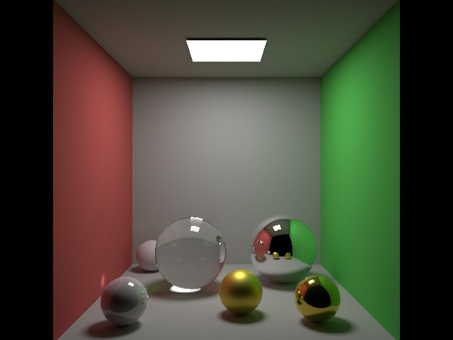

# Tutorial26 - Render State Cache

This tutorial expands the path tracing technique implemented in previous tutorial and demonstrates
how to use the render state cache to save pipeline states created at run time and load them when the
application starts.



[Tutorial 25](https://github.com/DiligentGraphics/DiligentSamples/tree/master/Tutorials/Tutorial25_StatePackager) shows
how to package pipeline states off-line during the build process. This tutorial demonstrates an alternative approach, where
pipeline states are created at run time, but when the application exits, they are saved to a file and loaded when
the application starts next time. It also demonstrates a very useful feature of the render state cache: hot
shader reload.


## Render State Cache

Render state cache object (`IRenderStateCache`) provides methods to create shaders and pipeline states that are
identical to the methods of the render device. However, for each call the cache attempts to find the object
data (e.g. compiled shader bytecode, pipeline state data etc.) to avoid expensive operation (such as shader compilation).
If the data is not found, the object is created and its data is added to the cache. The cache data can be requested from
the cache, stored in a file and loaded next time. 

Another major feature that the state cache implements is hot shader reloading. The cache stores all data required to create shader objects,
and when `Reload` method is called, the cache automatically detects which shaders need to be recompiled and which pipeline states need
to be updated. The pipelines are updated transparently for the application.

To create a render state cache object, prepare an instance of the `RenderStateCacheCreateInfo` struct:

```cpp
RenderStateCacheCreateInfo CacheCI;
CacheCI.pDevice = m_pDevice;
// Enable hot state reload
CacheCI.EnableHotReload = true;
CreateRenderStateCache(CacheCI, &m_pStateCache);
```

In this tutorial, we want to enable hot shader reloading, so we set the `EnableHotReload` member to `true`. Hot reloading
intoduces some overhead and applications should generally disable this feature in production builds.

Render state cache also allows using separate shader source stream factory specifically for reloading, which can be specified
through the `pReloadSource` member. In this example, we don't use this though.

At the next step, we check if the cache data from the previous application run exists and load it.
We start by constructing the cache file path name. We use the `FileSystem::GetLocalAppDataDirectory` function
that returns the platform-specific application data directory. If the directory does not exist, we create it:

```cpp
m_StateCachePath = FileSystem::GetLocalAppDataDirectory("DiligentEngine-Tutorial26");
if (!FileSystem::PathExists(m_StateCachePath.c_str()))
{
    // Create the directory if it does not exist
    FileSystem::CreateDirectory(m_StateCachePath.c_str());
}
```

Next, we append the file name to the path. We use different file names for each device type and configuration type.
This is not required as a single cache file can hold all data, but splitting it into multiple files is
more convenient.

```cpp
m_StateCachePath.push_back(FileSystem::SlashSymbol);
m_StateCachePath += "state_cache_";
m_StateCachePath += GetRenderDeviceTypeShortString(m_pDevice->GetDeviceInfo().Type);

#ifdef DILIGENT_DEBUG
m_StateCachePath += "_d";
#else
m_StateCachePath += "_r";
#endif
m_StateCachePath += ".bin";
```

Finally, we load the data into the cache, if it exists:

```cpp
if (FileSystem::FileExists(m_StateCachePath.c_str()))
{
    FileWrapper CacheDataFile{m_StateCachePath.c_str()};
    auto        pCacheData = DataBlobImpl::Create();
    if (CacheDataFile->Read(pCacheData))
    {
        m_pStateCache->Load(pCacheData);
    }
}
```

Before the application exits, we request the data from the cache and store it to the file:

```cpp
RefCntAutoPtr<IDataBlob> pCacheData;
m_pStateCache->WriteToBlob(&pCacheData);
FileWrapper CacheDataFile{m_StateCachePath.c_str(), EFileAccessMode::Overwrite};
CacheDataFile->Write(pCacheData->GetConstDataPtr(), pCacheData->GetSize());
```


## Render State Notation Parser

Second object that we need in this example is the render state notation parser, which loads
the Diligent Render State Notation files:

```cpp
RenderStateNotationParserCreateInfo ParserCI;
// Enable state reloading in the parser
ParserCI.EnableReload = true;
CreateRenderStateNotationParser(ParserCI, &m_pRSNParser);
```

Note that we also need to enable hot shader reloading in the parser.
Next, we load the DRSN file that describes pipeline states used in this tutorial:

```cpp
m_pRSNParser->ParseFile("RenderStates.json", pShaderSourceFactory);
```

Notice that in the previous tutorial we used the same file, but passed it over to the off-line
packager tool. This time we load it at run time.


## Render State Notation Loader

The state notation parser only loads the DRSN files, but does not create the actual objects.
This task is performed by the render state notation loader that combines the render state cache
and the state notation parser:

```cpp
RenderStateNotationLoaderCreateInfo LoaderCI;
LoaderCI.pDevice        = m_pDevice;
LoaderCI.pParser        = m_pRSNParser;
LoaderCI.pStateCache    = m_pStateCache;
LoaderCI.pStreamFactory = pShaderSourceFactory;
CreateRenderStateNotationLoader(LoaderCI, &m_pRSNLoader);
```

Creating pipeline states is very similar to how it is done in the previous tutorial
except that now we use the loader instead of the dearchiver. The loader uses a very similar API,
e.g.:

```cpp
LoadPipelineStateInfo LoadInfo;
LoadInfo.PipelineType = PIPELINE_TYPE_GRAPHICS;
LoadInfo.Name         = "Resolve PSO";

// Define the callback to set the render target and depth stencil formats.
// These formats are only known at run time, so we can't define them in the
// render state notation file.
auto ModifyResolvePSODesc = MakeCallback(
    [this](PipelineStateCreateInfo& PSODesc) {
        // Similar to Tutorial 25
    });

LoadInfo.ModifyPipeline      = ModifyResolvePSODesc;
LoadInfo.pModifyPipelineData = ModifyResolvePSODesc;
m_pRSNLoader->LoadPipelineState(LoadInfo, &m_pResolvePSO);
```

The loader transparently for the application uses the cache to create the state objects.

Shader create information can also be modified, e.g.:

```cpp
ShaderMacroHelper Macros;
Macros.AddShaderMacro("BRDF_SAMPLING_MODE_COS_WEIGHTED", BRDF_SAMPLING_MODE_COS_WEIGHTED);
Macros.AddShaderMacro("BRDF_SAMPLING_MODE_IMPORTANCE_SAMPLING", BRDF_SAMPLING_MODE_IMPORTANCE_SAMPLING);
Macros.AddShaderMacro("BRDF_SAMPLING_MODE", m_BRDFSamplingMode);
// Add more macros
// ...

auto ModifyShaderCI = MakeCallback(
    [&](ShaderCreateInfo& ShaderCI, SHADER_TYPE Type, bool& AddToLoaderCache) {
        VERIFY_EXPR(Type == SHADER_TYPE_COMPUTE);
        ShaderCI.Macros = Macros;
        // Do not add the shader to the loader's cache as
        // we may be recreating the shader at run-time.
        AddToLoaderCache = false;
    });

LoadPipelineStateInfo LoadInfo;
LoadInfo.ModifyShader      = ModifyShaderCI;
LoadInfo.pModifyShaderData = ModifyShaderCI;
LoadInfo.PipelineType      = PIPELINE_TYPE_COMPUTE;
LoadInfo.Name              = "Path Trace PSO";
// Do not add the PSO to the loader's cache as we may be
// recreating the pipeline.
LoadInfo.AddToCache = false;
m_pPathTracePSO.Release();
m_pRSNLoader->LoadPipelineState(LoadInfo, &m_pPathTracePSO);
```

The loader has its own cache that holds objects previously created by the application and
uses the object name as the key. In this example we recompile the path tracing
pipeline at run time when some of the settings change. The pipeline uses the same name, and
we don't want to get old pipeline from the loader cache, so we set `LoadInfo.AddToCache = false`.
Note that the pipeline is always added to the render state cache.

Hot reloading as easy as calling 

```cpp
m_pStateCache->Reload();
```

Try modifying shaders and pressing the Reload button in the UI - the effect will be immediate.
All new shader variation will be added to the cache. An application may need to delete the cache
if it contains a lot of intermediate states.

Note that there are some limitations to reloading functionality:

- Shader resources should not be modified as this will result in changing the shader resource layout,
  which will make existing shader resource binding objects incompatible with pipelines.
- Pipeline resource layout and shader resource signatures can't be modified.
- While shaders can be changed, a shader can't be replaced with another one in pipeline state description in a DRSN file

After pipeline states are loaded, they are used the same way as in the previous Tutorial.

## Path Tracing Improvements

Path tracing technique in this tutorial extends the method from Tutorial 25 and implements a number of major improvements:

- Smith-GGX BRDF with metallic-roughness parameterization
- Reflective (mirror) and refractive (glass) materials
- Importance sampling of the BRDF using the GGX distribution of visible normals
- Multiple importance sampling with balance heuristics

Please refer to the
[shader source code](https://github.com/DiligentGraphics/DiligentSamples/blob/master/Tutorials/Tutorial26_StateCache/assets/path_trace.csh)
for more details.


## Controlling the Application

- *Move camera*: left mouse button + WSADQE
- *Move light*:  right mouse button

UI controls:

- *Num bounces* - the number of bounces in each path
- *Show only last bounce* - render only the last bounce in the path
- *Next Event Estimation* - whether to perform the next event estimation at each bounce
- *BRDF Sampling mode*:
  - *Cosine-weighted*: use basic cosine-weighted hemispherical distribution
  - *Importance sampling*: use Smith-GGX importance sampling
- *NEE mode*:
  - *Sample Light*: use light source sampling
  - *Sample BRDF*: use BRDF sampling
  - *MIS*: use multiple importance sampling
  - *MIS - Light part*: use light sampling component of the multiple importance sampling
  - *MIS - BRDF part*: use BRDF sampling component of the multiple importance sampling
- *Balance Heuristics Power*: the exponent used in the MIS balance heuristics
- *Full BRDF Reflectance term*: use full equation (`BRDF * (n, w) / p(w)`) for the reflectance term.
  This option is intended for debugging purposes.
- *Samples per frame* - the number of light paths to take each frame for each pixel
- *Limit Sample Count*: whether to limit the total number of samples by the specific value
- *Reload States*: hot-reload modified shaders
- *Delete Cache File*: delete saved cached file


## Resources

1. [Optimally Combining Sampling Techniques for Monte Carlo Rendering](https://cseweb.ucsd.edu/~viscomp/classes/cse168/sp21/readings/veach.pdf) (1995) by Eric Veach and Leonidas J. Guibas
2. [Microfacet Models for Refraction through Rough Surfaces](https://www.cs.cornell.edu/~srm/publications/EGSR07-btdf.pdf) (2007) by Bruce Walter et. al.
3. [Understanding the Masking-Shadowing Function in Microfacet-Based BRDFs](https://jcgt.org/published/0003/02/03/) (2014) by Eric Heitz
4. [PBR Diffuse Lighting for GGX+Smith Microsurfaces](https://ubm-twvideo01.s3.amazonaws.com/o1/vault/gdc2017/Presentations/Hammon_Earl_PBR_Diffuse_Lighting.pdf) (2017) by Earl Hammon, Jr.
5. [A Simpler and Exact Sampling Routine for the GGX Distribution of Visible Normals](https://hal.archives-ouvertes.fr/hal-01509746/document) (2017) by Eric Heitz
6. [Sampling the GGX Distribution of Visible Normals](https://jcgt.org/published/0007/04/01/) (2018) by Eric Heitz
7. [Importance Sampling techniques for GGX with Smith Masking-Shadowing](https://schuttejoe.github.io/post/ggximportancesamplingpart2/) (2018) by Joe Schutte
