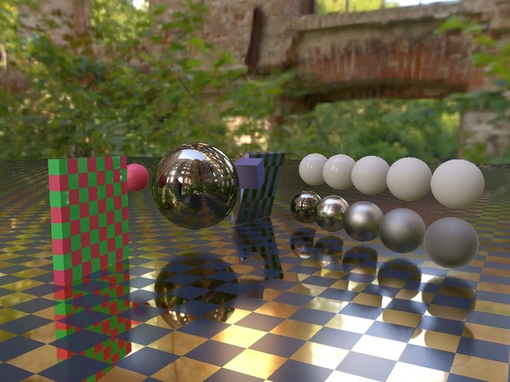

 # Tutorial27 - Post Processing



This tutorial demonstrates how to use post-processing effects from the DiligentFX module.

## Table of contents

- [Introduction](#introduction)
- [Render Passes](#render-passes)
    - [Generation G-Buffer](#generating-g-buffer)
    - [Computing of SSR](#computing-ssr)
    - [Computing of Lighting](#computing-lighting)
    - [Tone Mapping](#tone-mapping)
- [Resources](#resources)

## Introduction

In this tutorial, we demonstrate how you can integrate a post-processing stack into your project. At a high level, the rendering in this demo can be divided into the following parts:
- [Generating G-Buffer](#generation-g-buffer)
- [Computing SSR](#computing-ssr)
- [Computing Lighting](#computing-lighting)
- [Tone Mapping](#tone-mapping)

We use deferred lighting algorithm to generate images. Initially, we fill a G-Buffer. After that, screen space reflection (SSR)
is performed using the previous rendered frame. Following this, we computate lighting. The final phase is tone mapping.

## Render Passes

In this section, the main steps of rendering are listed.

### Generating G-Buffer

We use Deferred Shading instead of Forward Rendering because it simplifies the rendering pipeline when using post-effects such as SSAO and SSR.
We recommend familiarizing yourself with this tutorial [**[Learn OpenGL, Deferred Shading]**](https://learnopengl.com/Advanced-Lighting/Deferred-Shading)
if you have not previously encountered the deferred lighting algorithm. For this algorithm, before the lighting calculation stage, we generate a
G-Buffer using hybrid ray tracing. For this, we render the AABB (Axis-Aligned Bounding Box) of each object. In the pixel shader, for pixels covered
by the AABB in screen space, rays are generated which then search for intersections with the object depending on its geometry type (Sphere, Box).
After finding the intersection of the ray with the object, we compute the surface properties and record them in the G-Buffer. If no intersection
occurs, we call `discard` in the pixel shader.

For lighting, we use the PBR (Physically Based Rendering) approach with a Metallic-Roughness Workflow. If you are not familiar with these concepts,
we recommend reading this series of articles [**[Learn OpenGL, PBR]**](https://learnopengl.com/PBR/Theory). We use the following G-buffer:

```cpp
struct GBuffer
{
    float4 BaseColor    : SV_Target0; // TEX_FORMAT_RGBA8_UNORM
    float2 MaterialData : SV_Target1; // TEX_FORMAT_RG8_UNORM
    float4 Normal       : SV_Target2; // TEX_FORMAT_RGBA16_FLOAT
    float2 Motion       : SV_Target3; // TEX_FORMAT_RG16_FLOAT
    float  Depth        : SV_Depth;   // TEX_FORMAT_D32_FLOAT
};
```

Here is a description of each component.

| Name           | Description               |
|----------------|---------------------------|
| `BaseColor`    | `RGB` - Base Color of Surface |
| `MaterialData` | `R` - Roughness, `G` - Metalness, `B`- Occlusion |
| `Normal`       | `RGB` - World Space Normal |
| `Motion`       | `RG` - Motion Vector | 
| `Depth`        | `D` - Depth of surface |

The G-Buffer generation shader itself looks like this:

```hlsl
  float2 NormalizedXY = TexUVToNormalizedDeviceXY(VSOut.PixelPosition.xy * g_CurrCamera.f4ViewportSize.zw);
  Ray RayWS = CreateCameraRay(NormalizedXY);
  Ray RayLS = TransformRayToLocalSpace(RayWS);

  Intersection Intersect;
  Intersect.Distance = -FLT_MAX;
  Intersect.Normal = float3(0.0, 0.0, 0.0);

  switch (g_ObjectAttribs.ObjectType)
  {
      case GEOMETRY_TYPE_SPHERE:
          Intersect = IntersectSphere(RayLS, float3(0.0, 0.0, 0.0), 1.0);
          break;
      case GEOMETRY_TYPE_AABB:
          Intersect = IntersectAABB(RayLS, float3(0.0, 0.0, 0.0), float3(1.0, 1.0, 1.0));
          break;
      default:
          break;
  }

  if (Intersect.Distance < RayWS.Min || Intersect.Distance > RayWS.Max)
      discard;

  float3 PositionLS = RayLS.Origin + Intersect.Distance * RayLS.Direction;
  float3 PositionWS = RayWS.Origin + Intersect.Distance * RayWS.Direction;
  float3 NormalWS = ComputeNorma(Intersect.Normal);
  MaterialAttribs ObjectMaterial = ComputeMaterial(PositionWS);

  GBuffer Output;
  Output.BaseColor = ObjectMaterial.BaseColor;
  Output.MaterialData = float2(ObjectMaterial.Roughness, ObjectMaterial.Metalness);
  Output.Normal = float4(NormalWS, 1.0);
  Output.Motion = ComputeMotion(NormalizedXY, PositionLS);
  Output.Depth = ComputeDepth(PositionWS);
```

At this stage, we create a primary ray `CreateCameraRay` from the NDC coordinates and view and projection matrices
(see [**[Ray Generation, bmrysz]**](https://bmrysz.wordpress.com/2020/06/13/how-to-create-correct-ray-tracing-camera/)).
After creating the ray, we transform it into the object's Local Space, and then the ray searches for an intersection with
the object depending on its type. If you are interested in how to find the intersection of a ray with a transformed object,
we recommend reading this article [**[Ian Dunn, Zoë Wood, GPC]**](https://graphicscompendium.com/raytracing/12-transformations). 
The results are returned in the `Intersect` structure, which stores details of the intersection. This structure contains parameters
such as the surface normal `Normal` and  `Distance` parameter, representing the $t$ parameter in the linear equation:
$x = x_0 + r * t$ where $x_0$ - origin of ray `Ray::Origin`, $r$ - direction of ray `Ray::Direction`,
$x$ - intersection point `Position`. If no intersection occurs, we call `discard`. Next, we calculate the intersection points in
World Space and Local Space (The point in Local Space will be needed in the future for calculating the motion vector). Note that the
$t$ parameter is in Local Space, but it can be substituted into the ray equation from World Space, and we will obtain the correct
intersection point (you can read why this is the case in the article I mentioned earlier). Next, we transform the obtained normal
from Local Space to World Space using the object's normal matrix, and calculate the material of surface (we simply pass the material
of the object through a constant buffer).

If an intersection occurs, we record the corresponding parameters of the intersection point in the returned variable `Output`
(which is `GBuffer` structure we described earlier). One important detail here is the calculation of motion (velocity) vectors,
which will be required for the Screen Space Reflections (SSR) computation step. The velocity vector is a vector that contains the speed of
each pixel in NDC space. For more details on how to calculate motion vectors, you can read this article
[**[TAA, elopezr]**](https://www.elopezr.com/temporal-aa-and-the-quest-for-the-holy-trail/) section 'Motion Vectors'.
Conceptually, motion vector for the current pixel can be computed in four steps:

1) Calculate the current pixel's $NDC_1$ coordinates.
2) Calculate the current pixel's world position.
3) With the pixel's world position known, calculate the $NDC_0$ using the previous frame view and projection matrices.
4) Knowing the $NDC$ coordinates of both the current and previous frames, we obtain the velocity vector $NDC_1$ - $NDC_0$.

```hlsl
float2 ComputeMotion(float2 NDC1, float3 PositionLS)
{
    float4 PositionWS = mul(float4(PositionLS, 1.0), g_ObjectAttribs.PrevWorldTransform);
    float4 NDC0 = mul(PositionWS, g_PrevCamera.mViewProj);
    NDC0.xy = NDC0.xy / NDC0.w;

    float2 Motion = NDC1.xy - NDC0.xy;
    return Motion;
}
```

From the above code, you can see that our code does not entirely follow the described approach.
We pass a position point in Local Space, and then transform it from Local Space back to World Space,
but using the object's transformation matrix from the previous frame. This is done to ensure that the motion
vectors function correctly when the object moves. We recommend reading the article we mentioned earlier if you
are interested in understanding why this is necessary.


### Computing SSR

In this rendering pass, we compute the SSR. In this rendering pass, we calculate SSR (Screen Space Reflections) using the implementation
from the DiligentFX module. I recommend familiarizing yourself with the
[documentation](https://github.com/DiligentGraphics/DiligentFX/tree/master/PostProcess/ScreenSpaceReflection). Below is the СPU-side code
necessary to initiate this rendering pass:

```hlsl
{
    PostFXContext::FrameDesc FrameDesc;
    FrameDesc.Width  = m_pSwapChain->GetDesc().Width;
    FrameDesc.Height = m_pSwapChain->GetDesc().Height;
    FrameDesc.Index  = m_CurrentFrameNumber;
    m_PostFXContext->PrepareResources(FrameDesc);
    m_ScreenSpaceReflection->PrepareResources(m_pDevice, m_PostFXContext.get());
}

{
    PostFXContext::RenderAttributes PostFXAttibs;
    PostFXAttibs.pDevice          = m_pDevice;
    PostFXAttibs.pDeviceContext   = m_pImmediateContext;
    PostFXAttibs.pCameraAttribsCB = m_Resources[RESOURCE_IDENTIFIER_CAMERA_CONSTANT_BUFFER].AsBuffer();
    m_PostFXContext->Execute(PostFXAttibs);
}

{
    const Uint32 PrevFrameIdx = (m_CurrentFrameNumber + 0x1) & 0x1;

    ScreenSpaceReflection::RenderAttributes SSRRenderAttribs{};
    SSRRenderAttribs.pDevice            = m_pDevice;
    SSRRenderAttribs.pDeviceContext     = m_pImmediateContext;
    SSRRenderAttribs.pPostFXContext     = m_PostFXContext.get();
    SSRRenderAttribs.pColorBufferSRV    = m_Resources[RESOURCE_IDENTIFIER_RADIANCE0 + PrevFrameIdx].GetTextureSRV();
    SSRRenderAttribs.pDepthBufferSRV    = m_GBuffer->GetBuffer(GBUFFER_RT_DEPTH)->GetDefaultView(TEXTURE_VIEW_DEPTH_STENCIL);
    SSRRenderAttribs.pNormalBufferSRV   = m_GBuffer->GetBuffer(GBUFFER_RT_NORMAL)->GetDefaultView(TEXTURE_VIEW_SHADER_RESOURCE);
    SSRRenderAttribs.pMaterialBufferSRV = m_GBuffer->GetBuffer(GBUFFER_RT_MATERIAL_DATA)->GetDefaultView(TEXTURE_VIEW_SHADER_RESOURCE);
    SSRRenderAttribs.pMotionVectorsSRV  = m_GBuffer->GetBuffer(RESOURCE_IDENTIFIER_MOTION_VECTORS)->GetDefaultView(TEXTURE_VIEW_SHADER_RESOURCE);
    SSRRenderAttribs.pSSRAttribs        = &m_ShaderParams->SSRSettings;
    SSRRenderAttribs.FeatureFlag        = ScreenSpaceReflection::FEATURE_PREVIOUS_FRAME;
    m_ScreenSpaceReflection->Execute(SSRRenderAttribs);
}
```

There are three stages in the the code snippet above:

1) Resource preparation through the methods `PostFXContext::Prepare` and `ScreenSpaceReflection::Prepare`. At this stage, internal resources(such as constant buffers, textures, etc.) are created for each object, if they haven't been already.
2) Calculating the shared data by calling the method `PostFXContext::Execute`. Here, we compute data shared by all post-effects, such as Blue Noise texture.
3) Direct computation of SSR by calling `ScreenSpaceReflection::Execute`.

In the SSR computation stage, we pass the necessary data from our G-Buffer to the corresponding members of the
`ScreenSpaceReflection::RenderAttributes` structure. In `ColorBufferSRV`, we pass the previously rendered frame that is yet to be
processed through the tone mapping stage. Additionally, we pass the `ScreenSpaceReflection::FEATURE_PREVIOUS_FRAME` flag, thus telling
the algorithm that we are using the previous frame as input. We input the previous frame into SSR to simplify the rendering pipeline, as it
would otherwise require us to create separate render targets for the diffuse and specular components during lighting calculation. Additionally,
it would necessitate an extra pass for combining `[SSR, SpecularRadiance, DiffuseRadiance]`. Also, using the previous frame as the input color buffer
for SSR enables multiple bouncing.


### Computing Lighting

At this stage, we calculate the lighting based on data from the G-Buffer and SSR. We only IBL (Image-Based Lighting) in the demo.

```hlsl
SurfaceInformation SurfInfo = ExtractGBuffer(VSOut);
float3 F0 = lerp(float3(0.04, 0.04, 0.04), SurfInfo.BaseColor, SurfInfo.Metallness);
float3 F = FresnelSchlickRoughness(saturate(dot(SurfInfo.Normal, ViewDir)), F0, SurfInfo.Roughness);

float3 kS = F;
float3 kD = (float3(1.0, 1.0, 1.0) - kS) * (1.0 - SurfInfo.Metallness);

float3 Diffuse = SurfInfo.BaseColor * ComputeDiffuseIBL(SurfInfo.Normal);
float3 Specular = ComputeSpecularIBL(VSOut.f4PixelPos.xy, F0, SurfInfo.Normal, ViewDir, SurfInfo.Roughness);
float3 Radiance = kD * Diffuse + Specular;
```

In the code above, we first extract the surface information from the G-Buffer. Then, we calculate the diffuse and specular components of the rendering equation.
Let's move to the specular component computation, for which we computed the SSR:

```hlsl
float3 ComputeSpecularIBL(float2 Location, float3 F0, float3 N, float3 V, float Roughness)
{
    float NdotV = saturate(dot(N, V));
    float3 R = reflect(-V, N);
    float2 BRDF_LUT = SampleBRDFIntegrationMap(float2(NdotV, Roughness));
    float4 SSR = g_TextureSSR.Load(int3(Location, 0));
    float3 T1 = SamplePrefilteredEnvironmentMap(R, Roughness * g_PBRRendererAttibs.PrefilteredCubeLastMip); 
    float3 T2 = (F0 * BRDF_LUT.x + BRDF_LUT.yyy);
    return lerp(T1, SSR.rgb, SSR.w) * T2;
}
```

If you find this part of the code challenging to understand, I recommend reading the
[documentation](https://github.com/DiligentGraphics/DiligentFX/tree/master/PostProcess/ScreenSpaceReflection) in the section
'Implementation Details - Ray Tracing'. 
We extract the $T1$ and $T2$ sums, which are corresponding values in the Split-Sum Approximation expression. What does each sum represent
is explained in detail in the documentation. Subsequently, we perform the interpolation between $T1$ and the value from SSR, by alpha channel
of the SSR texture. This alpha channel have value `1.0` when the SSR's reflected ray intersects with any geometry, and `0.0` when there's no intersection.
Accordingly, we use the value from the Prefiltered Environment Map when no intersection has occurred.

### Tone Mapping

At this stage, we convert the HDR range to LDR. We use the Uncharted 2 function, passing the corresponding macro `TONE_MAPPING_MODE_UNCHARTED2`
when creating the pixel shader. For more details on the tone mapping process, we recommend reading this article
[**[Bart Wronski, ToneMap]**](https://bartwronski.com/2016/09/01/dynamic-range-and-evs/).

```hlsl
// g_ToneMappingAttibs.Padding0 - packed white point
float3 HDRColor = g_TextureHDR.Load(int3(VSOut.f4PixelPos.xy, 0));
float3 SDRColor = ToneMap(HDRColor, TMAttribs, g_PBRRendererAttibs.AverageLogLum);
```

## Resources

- **[Learn OpenGL, PBR]** Theory of Physycal Base Rendering - https://learnopengl.com/PBR/Theory
- **[Learn OpenGL, Deferred Shading]** Deferred Shading - https://learnopengl.com/Advanced-Lighting/Deferred-Shading
- **[Ray Generation, bmrysz]** How to create correct ray tracing camera - https://bmrysz.wordpress.com/2020/06/13/how-to-create-correct-ray-tracing-camera/
- **[TAA, elopezr]** Temporal AA and the quest for the Holy Trail - https://www.elopezr.com/temporal-aa-and-the-quest-for-the-holy-trail/
- **[Bart Wronski, ToneMap]** Image dynamic range - https://bartwronski.com/2016/09/01/dynamic-range-and-evs/
- **[Ian Dunn, Zoë Wood, GPC]** Graphics Programming Compendium Chapter 34: Transformations https://graphicscompendium.com/raytracing/12-transformations
