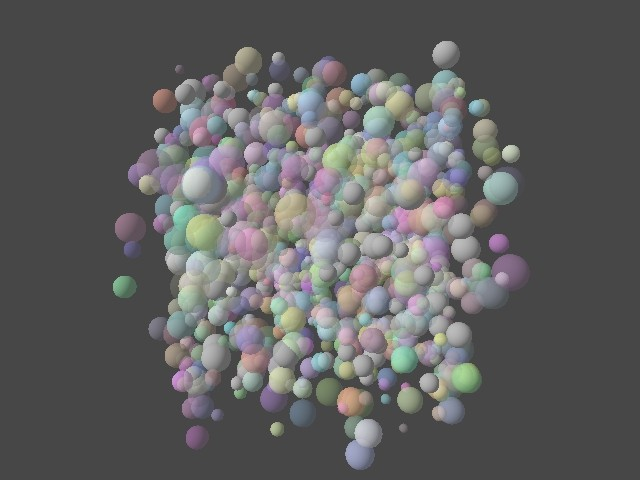

# Tutorial29 - Order-Independent Transparency

This tutorial demonstrates how to implement order-independent transparency (OIT) methods to render transparent objects without sorting.




# Introduction

Transparent objects have long posed a challenge in computer graphics because the order in which they are rendered affects the final image. This is due to the non-commutative nature of the blending operation - i.e., the order in which transparent surfaces are composited over each other matters. Sorting objects by their depth is only a partial solution because in many cases there is no single correct order that works for all pixels (for example, when transparent objects intersect, for self-overlapping transparent objects with complex geometry, or for nested objects). This is where order-independent transparency (OIT) comes in. OIT methods allow transparent objects to be rendered in any order without producing visual artifacts. This tutorial shows how to implement OIT in Diligent Engine.


# Algorithms

This tutorial demonstrates three different approaches to rendering transparent objects:

1. Unsorted alpha-blending
2. Weighted-blended OIT
3. Layered OIT

## Unsorted alpha-blending

This is the simplest approach. It is used here to illustrate the kind of visual artifacts that appear when rendering transparent objects without sorting.

## Weighted-blended OIT

[Weighted-blended OIT](https://casual-effects.blogspot.com/2015/03/implemented-weighted-blended-order.html) assigns weights to each transparent surface based on its depth and transparency, giving higher weights to surfaces closer to the camera and more opaque. This method is easy to implement and very efficient, but because it is an approximation, it has limitations:

1. The weighting functions often need tweaking on a per-scene basis to achieve the best results.
2. The method does not work well for surfaces with high opacity.

## Layered OIT

This approach is based on the method of [Fang Liu et al.](https://dl.acm.org/doi/10.1145/1730804.1730817). However, instead of storing the individual fragments, the algorithm builds a transmittance function that allows the transparent objects to be rendered in any order with additive blending.

Consider three surfaces A, B, and C that are composited on top of each other in that order. The final color is given by:

```
RGB = (RGB_A * T_B  + RGB_B) * T_C + RGB_C = RGB_A * T_B * T_C + RGB_B * T_C + RGB_C
```

where `RGB_A`, `RGB_B`, and `RGB_C` are the (alpha-premultiplied) colors of the surfaces, and `T_B` and `T_C` are the transmittance functions of the surfaces. The transmittance function is the fraction of light that passes through a given surface.

We can rewrite this more generally as:

```
RGB = RGB_A * Tc(A)  + RGB_B * Tc(B) + RGB_C * Tc(C)
```

where `Tc(X)` is the *cumulative* transmittance function from the camera to the surface `X`. This cumulative transmittance is the product of the transmittances of all surfaces between the camera and `X`. If we know the transmittance function for each pixel, we can render the transparent objects in any order using additive blending.


### The transmittance function

In our implementation, the transmittance function is represented by up to `K` closest layers, each storing that layer's transmittance and depth. Any additional layers are merged into a tail, which contains the total number of merged layers and the total transmittance. Each layer is packed into a 32-bit integer where the top 24 bits store the depth and the bottom 8 bits store the transmittance. This design allows us to sort layers by depth using atomic operations. The following function packs the layer data into a 32-bit integer:

```hlsl
uint PackOITLayer(float Depth, float Transmittance)
{
    uint D = uint(clamp(Depth, 0.0, 1.0) * 16777215.0);
    uint T = uint(clamp(Transmittance, 0.0, 1.0) * 255.0);
    return (D << 8u) | T;
}
```

Layer data is stored in a structured buffer, and the tail is stored in an RGBA8 texture.


### Implementation

After rendering all opaque objects, the algorithm proceeds with the following steps (described in detail below):

* Clear the OIT layers buffer
* Render transparent objects to build the transmittance function
* Attenuate the background
* Render transparent objects and composite them using the transmittance function

#### Clearing the OIT layers buffer

The layers buffer is cleared by a compute shader that sets the value of each element to `0xFFFFFFFF`, which indicates an empty layer.


#### Building the transmittance function

The main challenge is designing an algorithm that merges layers in parallel, given that multiple surfaces covering the same pixel might be processed simultaneously in arbitrary order.
We build upon the algorithm by Fang Liu et al. and use atomic operations. Recall that we pack the layer depth and transmittance into a 32-bit integer, making atomic min suitable for inserting a new layer into the buffer while keeping the buffer sorted by depth.
To insert a new layer, the shader performs atomic min operation with all stored layers in order. If the operation succeeds, the new layer is inserted into the buffer, and atomic operation returns the previous value, which in turn needs to be inserted into the buffer or merged into the tail.

Below is the key part of the pixel shader:

```hlsl
RWStructuredBuffer<uint> g_rwOITLayers;

// By default, early depth stencil will be disabled for this shader because it writes to a UAV.
// Force it to be enabled.
[earlydepthstencil]
float4 main(in PSInput PSIn) : SV_Target
{
    float D = PSIn.Pos.z;
    float A = lerp(g_Constants.MinOpacity, g_Constants.MaxOpacity, PSIn.Color.a);
    uint Layer = 0xFFFFFFFFu;
    if (A > OPACITY_THRESHOLD)
    {
        float T = 1.0 - A;
        Layer = PackOITLayer(D, T);
        uint Offset = GetOITLayerDataOffset(uint2(PSIn.Pos.xy), g_Constants.ScreenSize);
        for (uint i = 0; i < uint(NUM_OIT_LAYERS); ++i)
        {
            uint OrigLayer;
            InterlockedMin(g_rwOITLayers[Offset + i], Layer, OrigLayer);
            if (OrigLayer == 0xFFFFFFFFu || // Empty space
                OrigLayer == Layer)         // Layer matches another one exactly
            {
                // Do not update tail transmittance
                Layer = 0xFFFFFFFFu;
                break;
            }
            // Layer > OrigLayer: we did not insert the layer
            // Layer < OrigLayer: we inserted the layer, so now we need to 
            //                    insert the original layer
            Layer = max(Layer, OrigLayer);
        }
    }
    
    // RGB Blend: Src * 1 + Dst * 1
    // A   Blend: Src * 0 + Dst * SrcA
    if (Layer == 0xFFFFFFFFu)
    {
        return float4(0.0, 0.0, 0.0, 1.0);
    }
    else
    {
        float TailT = GetOITLayerTransmittance(Layer);
        return float4(1.0 / 255.0, 0.0, 0.0, TailT);
    }
}
```

The algorithm starts by obtaining the pixel depth value and the alpha value of the transparent object. Notice that alpha represents the object opacity, while we need the transmittance value which is `1 - A`. The opacity value is then compared with the opacity threshold that is set to `1.0/255.0`. Since we use 8 bits to store transmittance, any opacity below that corresponds to the fully transparent object and is discarded.

```hlsl
float D = PSIn.Pos.z;
float A = lerp(g_Constants.MinOpacity, g_Constants.MaxOpacity, PSIn.Color.a);
uint Layer = 0xFFFFFFFFu;
if (A > OPACITY_THRESHOLD)
{
    float T = 1.0 - A;
```

The algorithm then packs the layer data and starts inserting it into the buffer:

```hlsl
    Layer = PackOITLayer(D, T);
    uint Offset = GetOITLayerDataOffset(uint2(PSIn.Pos.xy), g_Constants.ScreenSize);
    for (uint i = 0; i < uint(NUM_OIT_LAYERS); ++i)
    {
```

For each layer, it performs atomic min operation in an attempt to insert the new layer. The operation returns the previous value stored in the buffer. Few outcomes are possible:

* Original value is `0xFFFFFFFF` - the layer is inserted into the empty space in the buffer. In this case, nothing else needs to be done.
* Original value is equal to the new layer - this is a rare case where two layers at the same depth have the same transmittance. In this case, the new layer is discarded.
* The two remaining cases is either the layer was successfully inserted and `OrigLayer` contains another value larger than the new layer, or the layer was not inserted and `OrigLayer` contains a value smaller that the new layer. In both cases, the algorithm needs to insert the maximum of the two values into the next position in the buffer.

```hlsl
    for (uint i = 0; i < uint(NUM_OIT_LAYERS); ++i)
    {
        uint OrigLayer;
        InterlockedMin(g_rwOITLayers[Offset + i], Layer, OrigLayer);
        if (OrigLayer == 0xFFFFFFFFu || OrigLayer == Layer)
        {
            Layer = 0xFFFFFFFFu;
            break;
        }
        Layer = max(Layer, OrigLayer);
    }
```

Let's take a look at the following example. Suppose we have the following values in the buffer: `10`, `20`, `30`, and we want to insert the value `15`. The algorithm will perform the following steps:

1. Attempt to insert `15` into the first position. Since `10 < 15`, the buffer is not updated. `OrigLayer = 10`, `Layer = max(15, 10) = 15`
2. Attempt to insert `15` into the second position. Since `15 < 20`, the buffer is updated. `OrigLayer = 20`, `Layer = max(15, 20) = 20`. Buffer now contains `10`, `15`, `30`
3. Attempt to insert `20` into the third position. Since `20 < 30`, the buffer is updated. `OrigLayer = 30`, `Layer = max(20, 30) = 30`. Buffer now contains `10`, `15`, `20`, and we left with the value `30` that needs to be inserted into the tail.

Note that multiple shader invocations can attempt to insert different layers into the same place in the buffer. In general, the buffer contents may change between each loop iteration. However, the following considerations ensure that the insertion algorithm works correctly:

1. Values in the buffer may only decrease. If an algorithm is attempting to insert a value at position `i`, it may only be inserted at position `i` or later, no matter what other invocations are doing.
2. Each invocation guarantees that value at position `i` is larger than the value at position `i-1`. This ensures that the buffer is always sorted.

After the loop finishes, there are two possible outcomes: either the layer was inserted into empty space in the buffer, in which case `Layer == 0xFFFFFFFFu`, or we are left with the value that needs to be inserted into the tail. The tail is updated using the alpha blending. We accumulate the total number of tail layers in the color channel, and the total transmittance in the alpha channel:

```hlsl
// RGB Blend: Src * 1 + Dst * 1
// A   Blend: Src * 0 + Dst * SrcA
if (Layer == 0xFFFFFFFFu)
{
    return float4(0.0, 0.0, 0.0, 1.0);
}
else
{
    float TailT = GetOITLayerTransmittance(Layer);
    return float4(1.0 / 255.0, 0.0, 0.0, TailT);
}
```

An important property of this algorithm is that it is stable. The order in which transparent objects are rendered does not affect the final result. The `K` closest layers are stored in the buffer, and all other layers are merged into the tail. The tail blending operations are commutative, so the order in which they are composited does not matter.

**Note**: The `earlydepthstencil` attribute is crucial because writing to a UAV normally disables early depth-stencil tests. We re-enable them to ensure opaque objects correctly occlude transparent ones behind them.

#### Attenuating the background

Before rendering the transparent objects, we first attenuate the background based on the computed transmittance function. We draw a full-screen quad that multiplies the background color by the product of all transmittances:

```hlsl
StructuredBuffer<uint> g_OITLayers;
Texture2D<float4>      g_OITTail;

void main(in float4 Pos : SV_Position,
          out PSOutput PSOut)
{
    uint Offset = GetOITLayerDataOffset(uint2(Pos.xy), g_Constants.ScreenSize);
    float T = 1.0;
    uint layer = 0u;
    while (layer < uint(NUM_OIT_LAYERS))
    {
        uint LayerDT = g_OITLayers[Offset + layer];
        if (LayerDT == 0xFFFFFFFFu)
            break;
        T *= GetOITLayerTransmittance(LayerDT);
        ++layer;
    }
    if (layer == uint(NUM_OIT_LAYERS))
    {
        float4 Tail = g_OITTail.Load(int3(Pos.xy, 0));
        T *= Tail.a;
    }
    if (T == 1.0)
        discard;

    // RGB blend: Src * 0 + Dst * SrcA
    PSOut.Color = float4(0.0, 0.0, 0.0, T);
}

```

This shader iterates over all layers in the buffer to accumulate the total transmittance value. If the maximum number of layers has been reached, the tail's transmittance is taken from the alpha channel of the tail texture. If `T` is 1.0 (meaning the background is unchanged), we simply discard the pixel. Otherwise, alpha-blending scales the background color by `T`.


#### Compositing the transparent objects

Finally, we render the transparent objects again, this time using the transmittance data to composite them correctly. The pixel shader computes how much light was transmitted from the current fragment by accumulating the transmittances of all layers closer to the camera:

```hlsl
float Depth = PSIn.Pos.z;
uint D = uint(Depth * 16777215.0);
float T = 1.0;
    
uint Offset = GetOITLayerDataOffset(uint2(PSIn.Pos.xy), g_Constants.ScreenSize);

uint layer = 0u;
while (layer < uint(NUM_OIT_LAYERS))
{
    uint LayerDT = g_OITLayers[Offset + layer];
    uint LayerD = GetOITLayerDepth(LayerDT);
    // +1u helps to avoid precision issues.
    if (D <= LayerD + 1u)
    {
        break;
    }
    float LayerT = GetOITLayerTransmittance(LayerDT);
    T *= LayerT;
    ++layer;
}
if (layer == uint(NUM_OIT_LAYERS))
{
    float4 Tail = g_OITTail.Load(int3(PSIn.Pos.xy, 0));
    // Average contribution of all tail layers.
    T /= max(255.0 * Tail.x, 1.0);
}

Color.rgb *= T;
```

Here, `T` accumulates the transmittances of all layers in front of the current fragment. If there are more than `K` layers, we take the average contribution from the tail. This ensures correct blending, even if many layers overlap.


### API-specific notes

* **WebGPU**: Since WebGPU does not support the `earlydepthstencil` attribute, the depth test must be done manually in the pixel shader.
* **OpenGL**: OpenGL does not allow using the default framebuffer's depth buffer with any other render target, so we must perform additional copies.


# Discussion

The layered OIT algorithm is both efficient and stable. It produces correct results when the number of overlapping transparent objects does not exceed the number of layers `K`. It also handles high-opacity objects (even fully opaque ones) correctly. For `K` layers, the algorithm requires `K * 4 + 4` bytes per pixel. For four layers, that amounts to 20 bytes. By adjusting `K`, you can balance memory usage and performance against image quality.

However, the algorithm is less efficient for large numbers of overlapping, highly transparent objects (e.g., smoke). In such cases, the weighted-blended OIT or [moment-based OIT](https://momentsingraphics.de/I3D2018.html) may be more suitable.

# References

- [Weighted Blended Order-Independent Transparency by Morgan McGuire and Louis Bavoil](https://jcgt.org/published/0002/02/09/)
- [Implementing Weighted, Blended Order-Independent Transparency by Morgan McGuire](https://casual-effects.blogspot.com/2015/03/implemented-weighted-blended-order.html)
- [Order-Independent Transparency Vulkan Sample by NVidia](https://github.com/nvpro-samples/vk_order_independent_transparency)
- [FreePipe: a programmable parallel rendering architecture for efficient multi-fragment effects by Fang Liu et al.](https://dl.acm.org/doi/10.1145/1730804.1730817)
- [Moment-Based Order-Independent Transparency by Cedrick Munstermann](https://momentsingraphics.de/I3D2018.html)
- [Wavelet Transparency by Maksim Aizenshtein](https://arxiv.org/abs/2201.00094)
