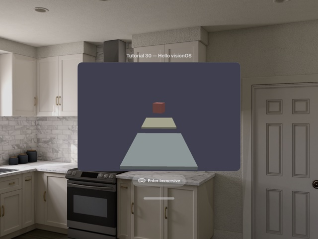

# Tutorial30 - Hello visionOS

This tutorial demonstrates how to run Diligent Engine on Apple visionOS. A single app hosts two
renderers that share the same scene: a 2D **Preview** window and a fully immersive space driven by
Apple **CompositorServices**.



## Prerequisites

- Xcode 16+ with the visionOS SDK (`xrsimulator` / `xros`).
- CMake 3.28+ (required for the `visionOS` system name).
- Apple Vision Pro device or the visionOS simulator.

Only the Metal backend is supported on visionOS. This tutorial is self-contained and does not use
`SampleBase` / `NativeAppBase`, because neither fits the SwiftUI + CompositorServices entry point
that visionOS requires.


## Building

Configure and build for the simulator:

```bash
cmake -S . -B build/visionOS -G Xcode \
      -DCMAKE_SYSTEM_NAME=visionOS \
      -DCMAKE_OSX_SYSROOT=xrsimulator \
      -DCMAKE_BUILD_TYPE=Debug
cmake --build build/visionOS --config Debug --target Tutorial30_HelloVisionOS \
      -- CODE_SIGN_IDENTITY="" CODE_SIGNING_ALLOWED=NO
```

For a device build, use `-DCMAKE_OSX_SYSROOT=xros` and supply a valid code signing identity.


## Application Structure

On visionOS the application entry point is a SwiftUI `App`. Because Swift can't call C++ directly,
the tutorial is split into three layers:

- **Swift / SwiftUI** (`src/visionOS/`) — declares the launcher window and the `ImmersiveSpace`,
  owns a `UIView` with a `CAMetalLayer` for preview and hands layers off to the C++ side.
- **Objective-C++ bridge** (`src/visionOS/VisionOSAppBridge.{h,mm}`) — owns the C++ preview /
  immersive driver objects and exposes them to Swift.
- **C++ renderers** (`src/Tutorial30_{RenderEngine,Preview,Immersive,Scene}.{hpp,cpp}`) —
  Diligent Engine code. `Tutorial30_RenderEngine` owns the process-wide Metal device and
  immediate context; `Tutorial30_Scene` is shared by the preview and immersive paths.

The preview is paused while an immersive space is opening or active, so the shared immediate
context and scene are not rendered from both SwiftUI paths at the same time. As an additional
safeguard, the Objective-C++ bridge submits all preview and immersive rendering work to one shared
serial render queue.


## Diligent Engine Integration

### Preview renderer

`Tutorial30_Preview` renders into a plain `CAMetalLayer`-backed `UIView`. This is the standard
Metal swap chain path — identical to any iOS/macOS Diligent application — so it serves as a
familiar starting point before the immersive renderer:

```cpp
Tutorial30_RenderEngine& Engine      = Tutorial30_RenderEngine::Get();
IEngineFactoryMtl*       pFactoryMtl = static_cast<IEngineFactoryMtl*>(Engine.GetEngineFactory());

SwapChainDesc SCDesc;
SCDesc.ColorBufferFormat = TEX_FORMAT_BGRA8_UNORM_SRGB;
SCDesc.DepthBufferFormat = TEX_FORMAT_D32_FLOAT;
SCDesc.Width             = WidthPx;
SCDesc.Height            = HeightPx;

NativeWindow Window{pCAMetalLayer};
pFactoryMtl->CreateSwapChainMtl(Engine.GetDevice(), Engine.GetImmediateContext(),
                                SCDesc, Window, &m_pSwapChain);
```

Rendering is scheduled by a `CADisplayLink` on the main thread and executed on the shared serial
render queue. The preview uses a simple orbit camera with right-handed view and projection matrices
(see below).


### Immersive renderer

`Tutorial30_Immersive` does **not** create a swap chain. CompositorServices owns the textures and
hands them out per frame, so the renderer only attaches a `CompositorServicesSession` to the shared
Diligent device and context:

```cpp
Tutorial30_RenderEngine& Engine = Tutorial30_RenderEngine::Get();

m_Session = std::make_unique<CompositorServicesSession>(LayerRenderer,
                                                        Engine.GetDevice(),
                                                        Engine.GetImmediateContext());
```

All of the CompositorServices frame pacing (timing query, world anchor update, pose prediction,
drawable acquisition and present) is encapsulated in `CompositorServicesSession` in
`Diligent-GraphicsTools`. The tutorial only provides two callbacks:

```cpp
void Tutorial30_Immersive::RenderFrame()
{
    Tutorial30_Scene& Scene = Tutorial30_RenderEngine::Get().GetScene();

    m_Session->RenderFrame(
        [&Scene] { Scene.Update(); },
        [this](void* pDrawable) { RenderDrawable(pDrawable); });
}
```

Each drawable contains one or two views (one per eye). For each view the renderer obtains the
color and depth textures from `CompositorServicesSession`, computes view/projection matrices
and submits the scene:

```cpp
RefCntAutoPtr<ITexture> pColor = m_Session->GetColorSwapchainImage(pDrawable, ViewIdx);
RefCntAutoPtr<ITexture> pDepth = m_Session->GetDepthSwapchainImage(pDrawable, ViewIdx);

const float4x4 ViewProj =
    m_Session->GetViewMatrix(pDrawable, ViewIdx) *
    m_Session->GetProjectionMatrix(pDrawable, ViewIdx, NearZ, FarZ);

Scene.Render(pImmediateContext,
             pColor->GetDefaultView(TEXTURE_VIEW_RENDER_TARGET),
             pDepth->GetDefaultView(TEXTURE_VIEW_DEPTH_STENCIL),
             ViewProj);

m_Session->PresentDrawable(pDrawable);
pImmediateContext->Flush();
pImmediateContext->FinishFrame();
pDevice->ReleaseStaleResources();
```

The immersive render loop runs on the shared serial render queue with `USER_INTERACTIVE` QoS, so it
never blocks the main thread and cannot overlap the preview renderer.


### Conventions: right-handed, reverse-Z

Both renderers use **right-handed view and projection matrices**:

- Immersive uses `cp_drawable_compute_projection(..., right_up_back, ...)` and a plain
  `simd_inverse` of the anchor-relative view transform.
- Preview builds RH matrices explicitly in `Tutorial30_Preview.cpp`.

Both also use **reverse-Z**: the depth target is cleared to `0`, the PSO uses
`COMPARISON_FUNC_GREATER_EQUAL`, and the immersive drawable is configured with
`cp_drawable_set_depth_range(FarZ, NearZ)`.

Because the RH convention flips NDC winding relative to the default D3D convention, the PSO sets
`FrontCounterClockwise = True` with `CULL_MODE_BACK`. This matches the canonical VR pattern used
by [Tutorial28_HelloOpenXR](../Tutorial28_HelloOpenXR/readme.md).

